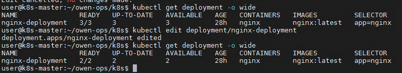

# Kubectl 资源对象管理

[TOC]

我们知道k8s中定义了大量的`资源对象` （e.g. pod, services,daemonset等），所以kubectl 最常使用的就是和各种资源对象打交道（查询，删除，更新，编辑，伸缩等等）。**由于kubectl 操作资源场景很多，该文档内容比较多，请耐心阅读！**

## 创建对象 (kubectl create/apply)

Kubernetes 的清单文件可以使用 json 或 yaml 格式定义。可以以 .yaml、.yml、或者 .json 为扩展名。

通过yaml文件创建：

``` shell
kubectl create -f xxx.yaml （不建议使用，无法更新，必须先delete）

kubectl apply -f xxx.yaml （创建+更新，可以重复使用）
```

``` shell

$ kubectl create -f ./my-manifest.yaml           # 创建资源
$ kubectl create -f ./my1.yaml -f ./my2.yaml     # 使用多个文件创建资源
$ kubectl create -f ./dir                        # 使用目录下的所有清单文件来创建资源
$ kubectl create -f https://git.io/vPieo         # 使用 url 来创建资源
$ kubectl run nginx --image=nginx                # 启动一个 nginx 实例
$ kubectl explain pods,svc                       # 获取 pod 和 svc 的文档

$ kubectl expose rc nginx --port=80 --target-port=8000 # 为 nginx RC 创建服务，启用本地 80 端口连接到容器上的 8000 端口

# 从 stdin 输入中创建多个 YAML 对象
$ cat <<EOF | kubectl create -f -
apiVersion: v1
kind: Pod
metadata:
  name: busybox-sleep
spec:
  containers:
  - name: busybox
    image: busybox
    args:
    - sleep
    - "1000000"
---
apiVersion: v1
kind: Pod
metadata:
  name: busybox-sleep-less
spec:
  containers:
  - name: busybox
    image: busybox
    args:
    - sleep
    - "1000"
EOF

# 创建包含几个 key 的 Secret
$ cat <<EOF | kubectl create -f -
apiVersion: v1
kind: Secret
metadata:
  name: mysecret
type: Opaque
data:
  password: $(echo "s33msi4" | base64)
  username: $(echo "jane" | base64)
EOF

```

## 显示查找资源 (kubectl get/describe)

- 查看资源

`kubectl get nodes|namespaces|services|pods|rc|deployments|replicasets(rs) -o wide`

- 查看资源详细描述

`kubectl describe ${type} ${name} -o wide`

- 查看 指定namespace 下面的pod/svc/deployment 等等（-o wide 选项可以查看存在哪个对应的节点）

`kubectl get pod/svc/deployment -n kube-system`

- 查看 所有namespace 下面的pod/svc/deployment等等

`kubectl get pod/svc/deployment --all-namespaces`


``` shell
# Get commands with basic output
$ kubectl get services                          # 列出所有 namespace 中的所有 service
$ kubectl get pods --all-namespaces             # 列出所有 namespace 中的所有 pod
$ kubectl get pods -o wide                      # 列出所有 pod 并显示详细信息
$ kubectl get deployment my-dep                 # 列出指定 deployment
$ kubectl get pods --include-uninitialized      # 列出该 namespace 中的所有 pod 包括未初始化的

# 使用详细输出来描述命令
$ kubectl describe nodes my-node
$ kubectl describe pods my-pod

$ kubectl get services --sort-by=.metadata.name # List Services Sorted by Name

# 根据重启次数排序列出 pod
$ kubectl get pods --sort-by='.status.containerStatuses[0].restartCount'

# 获取所有具有 app=cassandra 的 pod 中的 version 标签
$ kubectl get pods --selector=app=cassandra rc -o \
  jsonpath='{.items[*].metadata.labels.version}'

# 获取所有节点的 ExternalIP
$ kubectl get nodes -o jsonpath='{.items[*].status.addresses[?(@.type=="ExternalIP")].address}'

# 列出属于某个 PC 的 Pod 的名字
# “jq”命令用于转换复杂的 jsonpath，参考 https://stedolan.github.io/jq/
$ sel=${$(kubectl get rc my-rc --output=json | jq -j '.spec.selector | to_entries | .[] | "\(.key)=\(.value),"')%?}
$ echo $(kubectl get pods --selector=$sel --output=jsonpath={.items..metadata.name})

# 查看哪些节点已就绪
$ JSONPATH='{range .items[*]}{@.metadata.name}:{range @.status.conditions[*]}{@.type}={@.status};{end}{end}' \
 && kubectl get nodes -o jsonpath="$JSONPATH" | grep "Ready=True"

# 列出当前 Pod 中使用的 Secret
$ kubectl get pods -o json | jq '.items[].spec.containers[].env[]?.valueFrom.secretKeyRef.name' | grep -v null | sort | uniq
```

## 更新资源

### 资源标签 (kubectl label)

- 给node/pod添加标签 (增加lable值 [key]=[value])

`kubectl label pod redis-master-1033017107-q47hh role=master`

`kubectl label node k8s-node1 role=backend`

- 给node/pod删除标签(删除lable值)

`kubectl label nodes kube-node node-`
`kubectl label pod redis-master-1033017107-q47hh role-`

删除label，只需要在命令行最后指定label的key名，并加一个减号即可：
`kubectl label node k8s-node1 role-`

- 根据标签查询节点

`kubectl get node -a -l "key=test-node"`

### kubectl replace

- 强制替换，删除后重新创建资源。会导致服务中断
`$ kubectl replace --force -f ./pod.json`

- 更新单容器 pod 的镜像版本（tag）到 v4
`kubectl get pod mypod -o yaml | sed 's/\(image: myimage\):.*$/\1:v4/' | kubectl replace -f -`

`kubectl annotate pods my-pod icon-url=http://goo.gl/XXBTWq       # 添加注解`
`kubectl autoscale deployment foo --min=2 --max=10                # 自动扩展 deployment “foo”`

### kubectl set image

更新现有的资源对象的容器镜像。 可使用资源对象包括（不区分大小写）：pod (po)、replicationcontroller (rc)、deployment (deploy)、daemonset (ds)、job、replicaset (rs)

`image (-f FILENAME | TYPE NAME) CONTAINER_NAME_1=CONTAINER_IMAGE_1 ... CONTAINER_NAME_N=CONTAINER_IMAGE_N`

**示例:**

- 将deployment中的nginx容器镜像设置为“nginx：1.9.1”。
`kubectl set image deployment/nginx busybox=busybox nginx=nginx:1.9.1`

- 所有deployment和rc的nginx容器镜像更新为“nginx：1.9.1”
`kubectl set image deployments,rc nginx=nginx:1.9.1 --all`

- 将daemonset abc的所有容器镜像更新为“nginx：1.9.1”
`kubectl set image daemonset abc *=nginx:1.9.1`

- 从本地文件中更新nginx容器镜像
`kubectl set image -f path/to/file.yaml nginx=nginx:1.9.1 --local -o yaml`

### 滚动更新 （kubectl rollout）

rolling update：可以使得服务近乎无缝地平滑升级，即在不停止对外服务的前提下完成应用的更新。如果在升级过程中，发现有问题还可以中途停止update，并回滚到前面版本

Manage the rollout of a resource. Valid resource types include: deployments /daemonsets /statefulsets

```shell
kubectl rollout SUBCOMMAND [options]

SUBCOMMAND
- history（查看历史版本）
- pause（暂停资源）
- resume（恢复暂停资源）
- status（查看资源状态）
- undo（回滚版本）
```

``` shell
#回滚到之前的deployment
kubectl rollout undo deployment/abc

#查看daemonet的状态
kubectl rollout status daemonset/foo

#暂停正在滚动升级的deployment
kubectl rollout pause deployment  web-demo -n dev
```

**注意：** The deprecated command `kubectl rolling-update` has been removed

## 编辑资源 (kubectl edit)

在编辑器中编辑任何 API 资源。

``` shell
kubectl edit svc/docker-registry                      # 编辑名为 docker-registry 的 service
KUBE_EDITOR="nano" kubectl edit svc/docker-registry   # 使用其它编辑器
```

如图所示, 将 deployment/nginx-deployment 对象的 replicas改为 2，编辑后保存立即生效



## Scale 资源 （kubectl scale）

``` shell
# Scale a replicaset named 'foo' to 3
kubectl scale --replicas=3 rs/foo

# Scale a resource specified in "foo.yaml" to 3
kubectl scale --replicas=3 -f foo.yaml

# # If the deployment named mysql's current size is 2, scale mysql to 3
kubectl scale --current-replicas=2 --replicas=3 deployment/mysql  

# Scale multiple replication controllers
kubectl scale --replicas=5 rc/foo rc/bar rc/baz
```

## 修补资源 (kubectl patch)

使用策略合并补丁,并修补资源

```shell
$ kubectl patch node k8s-node-1 -p '{"spec":{"unschedulable":true}}' # 部分更新节点

# 更新容器镜像； spec.containers[*].name 是必须的，因为这是合并的关键字
$ kubectl patch pod valid-pod -p '{"spec":{"containers":[{"name":"kubernetes-serve-hostname","image":"new image"}]}}'

# 使用具有位置数组的 json 补丁更新容器镜像
$ kubectl patch pod valid-pod --type='json' -p='[{"op": "replace", "path": "/spec/containers/0/image", "value":"new image"}]'

# 使用具有位置数组的 json 补丁禁用 deployment 的 livenessProbe
$ kubectl patch deployment valid-deployment  --type json   -p='[{"op": "remove", "path": "/spec/template/spec/containers/0/livenessProbe"}]'
```

## 删除资源 (kubectl delete )

`kubectl delete ${type} ${name} -o wide`

``` shell
# 删除 pod.json 文件中定义的类型和名称的 pod
kubectl delete -f ./pod.json

# 删除名为“baz”的 pod 和名为“foo”的 service
kubectl delete pod,service baz foo

# 删除具有 name=myLabel 标签的 pod 和 serivce
kubectl delete pods,services -l name=myLabel

# 删除具有 name=myLabel 标签的 pod 和 service，包括尚未初始化的
kubectl delete pods,services -l name=myLabel --include-uninitialized

# 删除 my-ns namespace 下的所有 pod 和 serivce，包括尚未初始化的
kubectl -n my-ns delete po,svc --all

#删除kube-system 下Evicted状态的所有pod：
kubectl get pods -n kube-system |grep Evicted| awk '{print $1}'|xargs kubectl delete pod -n kube-system
```

## 其他特殊命令

- 在没有pod 的yaml文件时，强制重启某个pod
`kubectl get pod PODNAME -n NAMESPACE -o yaml | kubectl replace --force -f -`

- kubectl cp 用于pod和外部的文件交换

``` shell
user@k8s-master:~/owen-ops/k8s$ kubectl get pod -A
NAMESPACE              NAME                                        READY   STATUS    RESTARTS   AGE
default                busybox-sleep                               1/1     Running   0          127m
default                busybox-sleep-less                          1/1     Running   7          127m

user@k8s-master:~/owen-ops/k8s$ kubectl exec -it busybox-sleep /bin/sh
kubectl exec [POD] [COMMAND] is DEPRECATED and will be removed in a future version. Use kubectl kubectl exec [POD] -- [COMMAND] instead.
/ # cat /proc/version
Linux version 4.15.0-118-generic (buildd@lgw01-amd64-039) (gcc version 7.5.0 (Ubuntu 7.5.0-3ubuntu1~18.04)) #119-Ubuntu SMP Tue Sep 8 12:30:01 UTC 2020
/ # echo "this is a message from `hostname`" >message.log
/ # cat message.log
this is a message from busybox-sleep

#拷贝出来更新，然后拷贝回 pod
user@k8s-node-01:~$ kubectl cp  busybox-sleep:/message.log ./messsage.log
user@k8s-node-01:~$ echo "information added in `hostname`" >>message.log
user@k8s-node-01:~$ kubectl cp  ./message.log busybox-sleep:/message.log

#确认更改后的信息
user@k8s-master:~/owen-ops/k8s$ kubectl exec -it busybox-sleep cat /message.log
kubectl exec [POD] [COMMAND] is DEPRECATED and will be removed in a future version. Use kubectl kubectl exec [POD] -- [COMMAND] instead.
information added in k8s-node-01


```
