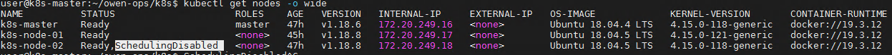
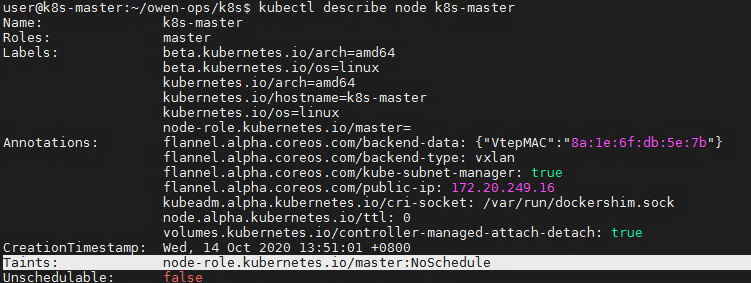

# Kubectl 管理维护集群

[TOC]

这里主要介绍 `集群节点` 级别的管理维护的日常命令操作

## 重启kubelet服务

``` shell
systemctl daemon-reload
systemctl restart kubelet
```

## 修改启动参数

``` shell
vim /etc/systemd/system/kubelet.service.d/10-kubeadm.conf
# Note: This dropin only works with kubeadm and kubelet v1.11+
[Service]
Environment="KUBELET_KUBECONFIG_ARGS=--bootstrap-kubeconfig=/etc/kubernetes/bootstrap-kubelet.conf --kubeconfig=/etc/kubernetes/kubelet.conf"
Environment="KUBELET_CONFIG_ARGS=--config=/var/lib/kubelet/config.yaml"
# This is a file that "kubeadm init" and "kubeadm join" generates at runtime, populating the KUBELET_KUBEADM_ARGS variable dynamically
EnvironmentFile=-/var/lib/kubelet/kubeadm-flags.env
# This is a file that the user can use for overrides of the kubelet args as a last resort. Preferably, the user should use
# the .NodeRegistration.KubeletExtraArgs object in the configuration files instead. KUBELET_EXTRA_ARGS should be sourced from this file.
EnvironmentFile=-/etc/default/kubelet
ExecStart=
ExecStart=/usr/bin/kubelet $KUBELET_KUBECONFIG_ARGS $KUBELET_CONFIG_ARGS $KUBELET_KUBEADM_ARGS $KUBELET_EXTRA_ARGS
Environment="KUBELET_EXTRA_ARGS="
```

## 查看集群信息

``` shell
# 显示 master 和服务的地址
$ kubectl cluster-info

# 将当前集群状态输出到 stdout
$ kubectl cluster-info dump

# 将当前集群状态输出到 /path/to/cluster-state
$ kubectl cluster-info dump --output-directory=/path/to/cluster-state
```

## 查看各组件信息和状态

```shell

kubectl get componentstatuses

NAME                 STATUS    MESSAGE             ERROR
controller-manager   Healthy   ok
scheduler            Healthy   ok
etcd-0               Healthy   {"health":"true"}
```

## 查看kubelet进程启动参数

ps -ef | grep kubelet

## 查看日志

`journalctl -u kubelet -f`

## 节点隔离/恢复

### 将pod赶到其他节点

对节点执行维护操作之前（例如：内核升级，硬件维护等），可以使用 kubectl drain 安全驱逐节点上面所有的 pod。安全驱逐的方式将会允许 pod 里面的容器遵循指定的 PodDisruptionBudgets 执行优雅的中止。

注： 默认情况下，kubectl drain 会忽略那些不能杀死的系统类型的 pod，如果您想了解更多详细的内容，请参考kubectl drain

kubectl drain 返回成功表明所有的 pod （除了前面排除的那些）已经被安全驱逐（遵循期望优雅的中止期，并且没有违反任何应用程序级别的中断预算）。然后，通过对物理机断电或者在云平台上删除节点所在的虚拟机，都能安全的将节点移除。

`kubectl drain node1`

`kubectl drain [node-name] --force --ignore-daemonsets --delete-local-data`

如图所示，原来的k8s-master-node02 上的pod (nginx, dashboard) 经过驱逐，都被赶到了 k8s-master-node01 上


### 解除不可调度状态

执行完成后，如果没有任何错误返回，您可以关闭节点（如果是在云平台上，可以删除支持该节点的虚拟机）。

如图所示，执行`kubectl drain` 后， 被驱逐node 处于 `SchedulingDisabled` 状态，即它不能被调度



`kubectl uncordon node1 #执行完维护后，将节点重新加入调度`

### 设为不可调度状态

`kubectl cordon node1`

### master运行pod

kubectl taint nodes k8s-master node-role.kubernetes.io/master-

### master不运行pod

kubectl taint nodes k8s-master node-role.kubernetes.io/master=:NoSchedule

如图所示，kubeadm搭建的集群默认就给 master 节点添加了一个污点标记，所以我们看到我们平时的 pod 都没有被调度到 master 上去

