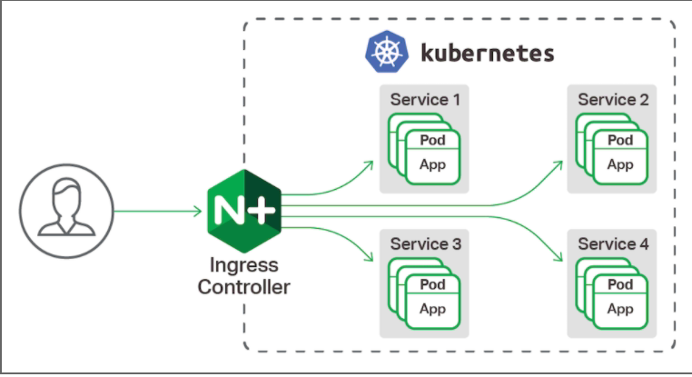

# k8s- Nginx-Ingress

## 介绍

Ingress本质是通过http代理服务器将外部的http请求转发到集群内部的后端服务。



## Ingress 组成

- ingress controller
　　将新加入的Ingress转化成Nginx的配置文件并使之生效
- ingress服务
　　将Nginx的配置抽象成一个Ingress对象，每添加一个新的服务只需写一个新的Ingress的yaml文件即可

## Ingress 工作原理

本质：7层http/https代理

1. ingress controller通过和kubernetes api交互，动态的去感知集群中ingress规则变化，
2. 然后读取它，按照自定义的规则，规则就是写明了哪个域名对应哪个service，生成一段nginx配置，
3. 再写到nginx-ingress-control的pod里，这个Ingress controller的pod里运行着一个Nginx服务，控制器会把生成的nginx配置写入/etc/nginx.conf文件中，
4. 然后reload一下使配置生效。以此达到域名分配置和动态更新的问题。

## Ingress 可以解决什么问题

1. 动态配置服务
　　如果按照传统方式, 当新增加一个服务时, 我们可能需要在流量入口加一个反向代理指向我们新的k8s服务. 而如果用了Ingress, 只需要配置好这个服务, 当服务启动时, 会自动注册到Ingress的中, 不需要而外的操作.

2. 减少不必要的端口暴露
　　配置过k8s的都清楚, 第一步是要关闭防火墙的, 主要原因是k8s的很多服务会以NodePort方式映射出去, 这样就相当于给宿主机打了很多孔, 既不安全也不优雅. 而Ingress可以避免这个问题, 除了Ingress自身服务可能需要映射出去, 其他服务都不要用NodePort方式

## Ingress 定义

 例如，您可以将 foo.yourdomain.com 上的所有内容发送到 foo 服务，并将 mydomain.com/bar/ 路径下所有内容发送到 bar 服务的

``` yaml
apiVersion: extensions/v1beta1
kind: Ingress
metadata:
  name: my-ingress
spec:
  backend:
    serviceName: other
    servicePort: 8080
  rules:
  - host: foo.mydomain.com
    http:
      paths:
      - backend:
          serviceName: foo
          servicePort: 8080
  - host: mydomain.com
    http:
      paths:
      - path: /bar/*
        backend:
          serviceName: bar
          servicePort: 8080

```

- host指虚拟出来的域名
- path:/console匹配后面的应用路径
- servicePort主要是定义服务的时候的端口，不是NodePort.
- path:/ 匹配后面应用的路径

## Ingress Controller 部署

示例 - <https://git.augmentum.com.cn/aug-ops/devops/-/tree/master/k8s/ingress-nginx>
