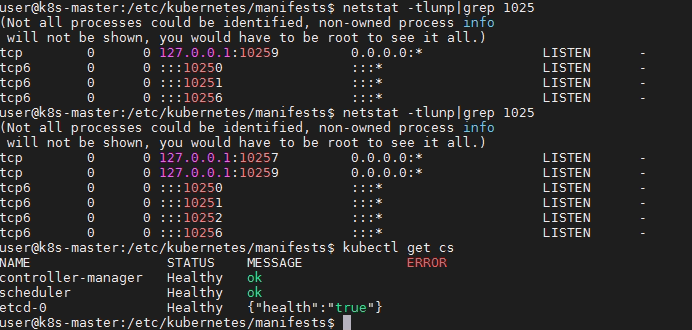
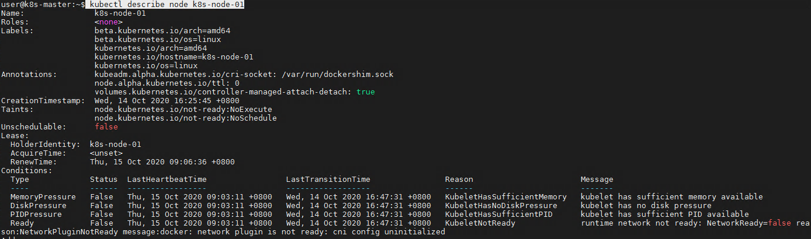

# K8S 搭建踩坑总结

## 问题-1 安装好后执行kubectl get node显示unable to connect to the server

`kubeadm init` 执行后，执行`kubectl get nodes`打印如下错误:

```shell
user@k8s-master:~$ kubectl get nodes
Unable to connect to the server: x509: certificate signed by unknown authority (possibly because of "crypto/rsa: verification error" while trying to verify candidate authority certificate "kubernetes")
```

原因： 如果你在执行 `kubeadm reset` 命令后没有删除创建的 $HOME/.kube目录，重新创建集群就会出现这个问题

```text
user@k8s-master:~$ sudo kubeadm reset
[sudo] password for user:
[reset] Reading configuration from the cluster...
[reset] FYI: You can look at this config file with 'kubectl -n kube-system get cm kubeadm-config -oyaml'
[reset] WARNING: Changes made to this host by 'kubeadm init' or 'kubeadm join' will be reverted.
[reset] Are you sure you want to proceed? [y/N]: y
[preflight] Running pre-flight checks
[reset] Removing info for node "k8s-master" from the ConfigMap "kubeadm-config" in the "kube-system" Namespace
...
.Please manually remove this etcd member using etcdctl
[reset] Stopping the kubelet service
[reset] Unmounting mounted directories in "/var/lib/kubelet"
[reset] Deleting contents of config directories: [/etc/kubernetes/manifests /etc/kubernetes/pki]
[reset] Deleting files: [/etc/kubernetes/admin.conf /etc/kubernetes/kubelet.conf /etc/kubernetes/bootstrap-kubelet.conf /etc/kubernetes/controller-manager.conf /etc/kubernetes/scheduler.conf]
[reset] Deleting contents of stateful directories: [/var/lib/etcd /var/lib/kubelet /var/lib/dockershim /var/run/kubernetes /var/lib/cni]

The reset process does not clean CNI configuration. To do so, you must remove /etc/cni/net.d

The reset process does not reset or clean up iptables rules or IPVS tables.
If you wish to reset iptables, you must do so manually by using the "iptables" command.

If your cluster was setup to utilize IPVS, run ipvsadm --clear (or similar)
to reset your system's IPVS tables.

The reset process does not clean your kubeconfig files and you must remove them manually.
Please, check the contents of the $HOME/.kube/config file.

```

## 问题-2

K8s集群初始化成功后，kubectl get nodes 查看节点信息时报错

```text
user@k8s-master:~$ sudo kubectl get nodes
The connection to the server localhost:8080 was refused - did you specify the right host or port?
```

`kubeadm init` 执行后，需要执行下列命令

``` shell
mkdir -p $HOME/.kube
sudo cp -i /etc/kubernetes/admin.conf $HOME/.kube/config
sudo chown $(id -u):$(id -g) $HOME/.kube/config
```

## 问题-3

`runtime network not ready: NetworkReady=false reason:NetworkPluginNotReady message:docker: network plugin is not ready: cni config uninitialized`

出现这个错误提示信息已经很明显,网络插件没有准备好.我们可以执行命令docker images|grep flannel来查看flannel镜像是否已经成功拉取下来.经过排查,flannel镜像拉取的有点慢,稍等一会以后就ok了

## 问题-4 使用kubectl get cs查看显示controller-manager、scheduler状态为Unhealthy


这两个pod的非安全端口没有开启，健康检查时报错，但是由于本身服务是正常的(node ready)，只是健康检查的端口没启，所以不影响正常使用

解决办法：开启scheduler， control-manager的10251，10252端口

修改以下配置文件：

``` text
静态pod的路径：cd /etc/kubernetes/manifests

vi kube-scheduler.yaml，把port=0那行注释
vi kube-controller-manager.yaml，把port=0那行注释
```



## 问题-5  network plugin is not ready: cni config uninitialized

```text
runtime network not ready: NetworkReady=false reason:NetworkPluginNotReady message:docker: network plugin is not ready: cni config uninitialized
```



这种情况一般都是 网络插件没有安装