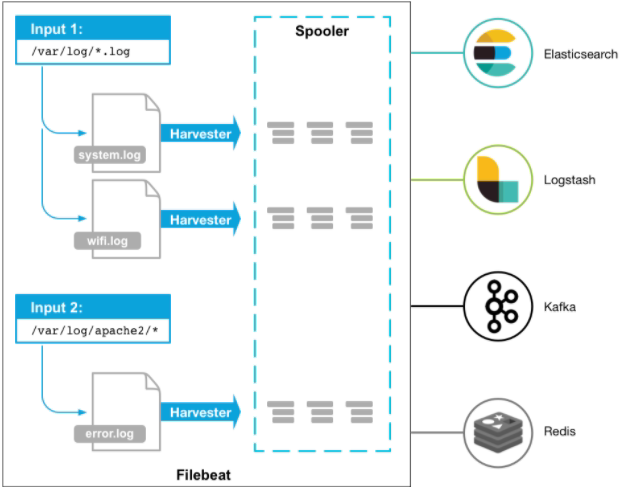

# Filebeat 工作原理

Filebeat涉及两个组件：“探测器prospector”和“采集器harvester”，这两类组件一起协作完成Filebeat的工作。



启动Filebeat时，它会启动一个或多个查找器，查看你为日志文件指定的本地路径。对于prospector所在的每个日志文件，prospector启动harvester。每个harvester都会为新内容读取单个日志文件，并将新日志数据发送到libbeat，后者将聚合事件并将聚合数据发送到你为Filebeat配置的输出。

当发送数据到Logstash或Elasticsearch时，Filebeat使用一个反压力敏感(backpressure-sensitive)的协议来解释高负荷的数据量。当Logstash数据处理繁忙时，Filebeat放慢它的读取速度。一旦压力解除，Filebeat将恢复到原来的速度，继续传输数据。

## Harvester（采集器）

负责读取单个文件内容。每个文件会启动一个Harvester，每个Harvester会逐行读取各个文件，并将文件内容发送到制定输出中。

Harvester负责打开和关闭文件，意味在Harvester运行的时候，文件描述符处于打开状态，如果文件在收集中被重命名或者被删除，Filebeat会继续读取此文件。所以在Harvester关闭之前，磁盘不会被释放。

默认情况filebeat会保持文件打开的状态，直到达到`close_inactive`（如果此选项开启，filebeat会在指定时间内将不再更新的文件句柄关闭，时间从harvester读取最后一行的时间开始计时。若文件句柄被关闭后，文件发生变化，则会启动一个新的harvester。关闭文件句柄的时间不取决于文件的修改时间，若此参数配置不当，则可能发生日志不实时的情况，由scan_frequency参数决定，默认10s。

Harvester使用内部时间戳来记录文件最后被收集的时间。例如：设置5m，则在Harvester读取文件的最后一行之后，开始倒计时5分钟，若5分钟内文件无变化，则关闭文件句柄。默认5m）。

## Prospector（探测器）

负责管理Harvester,并找到所有读取源。

```yml
filebeat.prospectors:
- input_type: log
  paths:
    - /apps/logs/*/info.log
```

Filebeat目前支持两种prospector类型：log和stdin

Prospector会找到/apps/logs/*目录下的所有info.log文件，并为每个文件启动一个Harvester。Prospector会检查每个文件，看Harvester是否已经启动，是否需要启动，或者文件是否可以忽略。若Harvester关闭，只有在文件大小发生变化的时候Prospector才会执行检查。

**注：** Filebeat prospector只能读取本地文件，没有功能可以连接到远程主机来读取存储的文件或日志。

**Filebeat如何记录文件状态：**

将文件状态记录在文件中（默认在/var/lib/filebeat/registry）。此状态可以记住Harvester收集文件的偏移量。若连接不上输出设备，如ES等，filebeat会记录发送前的最后一行，并再可以连接的时候继续发送。Filebeat在运行的时候，Prospector状态会被记录在内存中。Filebeat重启的时候，利用registry记录的状态来进行重建，用来还原到重启之前的状态。每个Prospector会为每个找到的文件记录一个状态，对于每个文件，Filebeat存储唯一标识符以检测文件是否先前被收集。

**Filebeat如何保证事件至少被输出一次：**

Filebeat之所以能保证事件至少被传递到配置的输出一次，没有数据丢失，是因为filebeat将每个事件的传递状态保存在文件中。在未得到输出方确认时，filebeat会尝试一直发送，直到得到回应。若filebeat在传输过程中被关闭，则不会再关闭之前确认所有时事件。任何在filebeat关闭之前为确认的时间，都会在filebeat重启之后重新发送。这可确保至少发送一次，但有可能会重复。可通过设置`shutdown_timeout` 参数来设置关闭之前的等待事件回应的时间（默认禁用)
