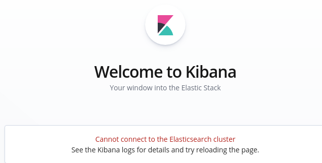
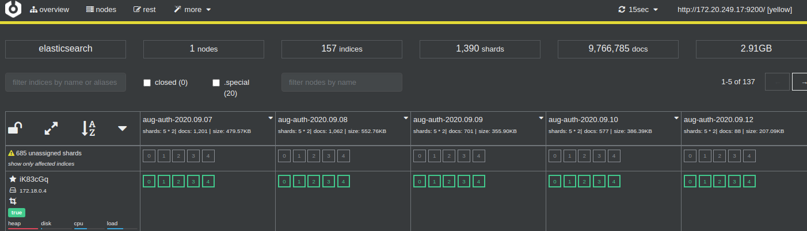

# ES 单节点 unassigned_shards 故障

## 故障现象



在部署ELK的单机环境，当连接Kibana时候提示下面错误，即使重启整个服务也是提示`Kibana server is not ready`.

```text
{"message":"all shards failed: [search_phase_execution_exception] all shards failed","statusCode":503,"error":"Service Unavailable"}
```

## 排查过程

前段时间ELK服务还是正常的，进入容器去ping ip 也都没问题，服务也都是`Up` 状态； ElasticSearch 服务也可以通过`http://localhost:9200/` 访问到，但是就是kibana 不能连接ElasticSearch


再查看 kibana 日志发现如下信息, 其中包含了`no_shard_available_action_exception`, 看起来是`分片` 的问题。

```json
{"type":"error","@timestamp":"2020-09-15T00:41:09Z","tags":["warning","stats-collection"],"pid":1,"level":"error","error":{"message":"[no_shard_available_action_exception] No shard available for [get [.kibana][doc][config:6.8.11]: routing [null]]","name":"Error","stack":"[no_shard_available_action_exception] No shard available for [get [.kibana][doc][config:6.8.11]: routing [null]] :: {\"path\":\"/.kibana/doc/config%3A6.8.11\",\"query\":{},\"statusCode\":503,\"response\":\"{\\\"error\\\":{\\\"root_cause\\\":[{\\\"type\\\":\\\"no_shard_available_action_exception\\\",\\\"reason\\\":\\\"No shard available for [get [.kibana][doc][config:6.8.11]: routing [null]]\\\"}],routing [null]]"}
```

通过 [ES可视化工具-cerebro](https://blog.csdn.net/liumiaocn/article/details/98517815) 查看  



实际当时情况是"红色"的，而不是目前看到的 "黄色"， `heap/disk/cup/load` 基本都是红色的, 可能因为当时手动删除了几个index原因  

黄色虽然kibana可以访问ES了，但是`黄色代表ES仍然是不健康的`

### 查看单节点Elasticsearch健康状态

`curl -XGET http://localhost:9200/_cluster/health\?pretty`

```json
{
  "cluster_name" : "elasticsearch",
  "status" : "red",
  "timed_out" : false,
  "number_of_nodes" : 1,
  "number_of_data_nodes" : 1,
  "active_primary_shards" : 677,
  "active_shards" : 677,
  "relocating_shards" : 0,
  "initializing_shards" : 4,
  "unassigned_shards" : 948,
  "delayed_unassigned_shards" : 0,
  "number_of_pending_tasks" : 5,
  "number_of_in_flight_fetch" : 0,
  "task_max_waiting_in_queue_millis" : 599,
  "active_shards_percent_as_number" : 41.559238796807854
}
```

从上面的 `unassigned_shards` 可以存在大量分片没有被分配，当时看到的实际有1000多个。

### 查询 UNASSIGNED 类型的索引名字

`curl -XGET http://localhost:9200/_cat/shards`


故障原因大概确定了，应该就是`unassigned_shards`导致的 下面就看如何解决

## 解决方案

1. 如果是集群环境，可以考虑使用 `POST /_cluster/reroute` 强制把问题分片分配到其中一个节点上了  

2. 但是对于目前的单机环境，从上面截图可以看出存在5个 unassigned 的分片，新建索引时候，分片数为5，副本数为1，新建之后集群状态成为yellow，其根本原因是因为集群存在没有启用的副本分片。

    解决办法就是，在单节点的elasticsearch集群，删除存在副本分片的索引，新建索引的副本都设为0。然后再查看集群状态  

    通过如果下命令，设置`number_of_replicas=0`,将副本调整为0. 如下图所示，es变成了“绿色”

    ``` shell
    curl -XPUT 'http://localhost:9200/_settings' -H 'content-Type:application/json' -d'
    {
    "number_of_replicas": 0
    }'
    ```

    

## 知识点

**副本分片** 主要目的就是为了故障转移，如果持有主分片的节点挂掉了，一个副本分片就会晋升为主分片的角色。

所以副本分片和主分片是不能放到一个节点上面的，可是在只有一个节点的集群里，副本分片没有办法分配到其他的节点上，所以出现所有副本分片都unassigned得情况。因为只有一个节点，如果存在主分片节点挂掉了，那么整个集群理应就挂掉了，不存在副本分片升为主分片的情况。  

## 参考

- <https://www.datadoghq.com/blog/elasticsearch-unassigned-shards/#monitoring-for-unassigned-shards>
- <https://stackoverflow.com/questions/19967472/elasticsearch-unassigned-shards-how-to-fix>
- <https://www.cnblogs.com/ningskyer/articles/5986642.html>