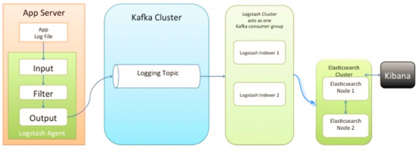
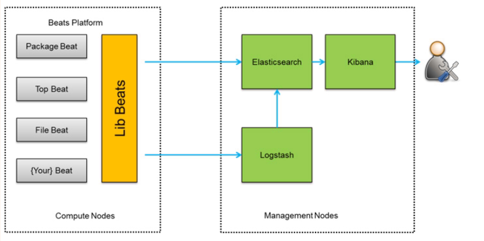

# ELK

这里介绍几种常见的ELK架构，主要区别还是在"日志收集器"选择和缓存部分，可根据情况选择合适架构

## 架构-1

这是**最简单**的一种ELK架构方式。优点是搭建简单，易于上手。缺点是Logstash耗资源较大，运行占用CPU和内存高。另外没有消息队列缓存，存在数据丢失隐患。

此架构由Logstash分布于各个节点上搜集相关日志、数据，并经过分析、过滤后发送给远端服务器上的Elasticsearch进行存储。Elasticsearch将数据以分片的形式压缩存储并提供多种API供用户查询，操作。用户亦可以更直观的通过配置Kibana Web方便的对日志查询，并根据数据生成报表

## 架构-2

此种架构引入了消息队列机制，位于各个节点上的Logstash Agent先将数据/日志传递给Kafka（或者Redis），并将队列中消息或数据间接传递给Logstash，Logstash过滤、分析后将数据传递给Elasticsearch存储。最后由Kibana将日志和数据呈现给用户。因为引入了Kafka（或者Redis）,所以即使远端Logstash server因故障停止运行，数据将会先被存储下来，从而避免数据丢失

## 架构-3

此种架构将收集端logstash替换为beats，更灵活，消耗资源更少，扩展性更强。同时可配置Logstash 和Elasticsearch 集群用于支持大集群系统的运维日志数据监控和查询