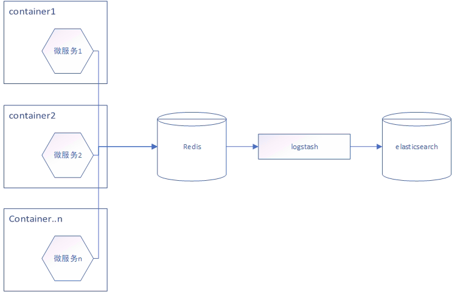

# docker 容器日志收集

[TOC]

一般，当我们部署服务到docker中后，可以通过如下命令查看服务的日志

`docker logs ${containerName}`

但这种方式并不能让你实时获取日志并对它们进行收集。但是docker还是比较友好的，它把这些日志文件都保存在以容器ID为文件名的文件系统中。

` /var/lib/docker/containers/${fullContainerId}/${fullContainerId}-json.log`

不过并不建议去这里直接读取内容，另外某些情况下，你不一定可以通过`docker logs ${containerName}`得到你想要的日志,因为 Docker 提供了更完善地日志收集方式 - Docker 日志收集驱动, 它可以将日志输出到其他地方，不仅仅是本地json文件。

>In some cases, docker logs may not show useful information unless you take additional steps.
> - If you use a logging driver which sends logs to a file, an external host, a database, or another logging back-end, docker logs may not show useful information.
> - If your image runs a non-interactive process such as a web server or a database, that application may send its output to log files instead of STDOUT and STDERR.

## Docker日志管理&&日志驱动

在了解容器日志收集方案前，你需要知道Docker的日志管理的日志驱动，

Docker日志管理

- <https://www.cnblogs.com/operationhome/p/10907591.html>

Docker日志驱动

- <https://docs.docker.com/config/containers/logging/configure/#supported-logging-drivers>

## 容器日志收集方案

### 1. Filebeat+ 本地json日志收集

- <https://docs.docker.com/config/containers/logging/json-file/>

filebeat不用多说就是扫描本地磁盘日志文件，读取文件内容然后远程传输。

docker容器日志默认记录方式为 json-file, 即将日志以json格式记录在磁盘上

格式如下：

``` json
{"log":"Log line is here\n","stream":"stdout","time":"2019-01-01T11:11:11.111111111Z"}
```

docker日志记录位置默认（centos7）为： /var/lib/docker/containers

- 全局docker配置

``` json
{
  "log-driver": "json-file",
  "log-opts": {
    "max-size": "10m",
    "max-file": "3"
  }
}

```

- 特定容器配置

``` shell
$ docker run \
      --log-driver local --log-opt max-size=10m \
      alpine echo hello world

```

这个方案有一个麻烦的问题，每个文件夹代表一个容器，如果要区分索引的话就需要设置，或解析日志，多个容器副本在多个宿主机上运行，需要拿到对应的服务名称等关键字段。如果大锅烩或一起全部收集可能会造成日志混乱，搜索排除条件增多，性能不佳等（ES服务器配置牛逼除外）

### 2. Filebeat+ syslog 本地日志收集

- https://docs.docker.com/config/containers/logging/syslog/

与方案一一样都是把日志输出到本地文件系统使用filebeat进行扫描采集, 不同的是输出的位置是不一样的

``` shell
docker run \
      --log-driver syslog --log-opt syslog-address=udp://1.2.3.4:1111 \
      alpine echo hello world
```

这种方案同样有问题，就是所有运行在本宿主机的容器和系统日志混在一起，除非做正则进行配置筛选或不筛选。同样造成日志的混乱。这里解决了方案一的一个潜在问题就是可以设置操作系统的日志留存时间，这个日志记录是有时间维度进行滚动删除的，同时日志不会变目录。

### 3. Filebeat+ journald 本地日志收集

- https://docs.docker.com/config/containers/logging/journald/

其实方案三和方案二日志采集套路一样,使用 journald方式与syslog不同的地方在于可以使用命令对日志进行筛选

``` shell
docker run --log-driver=journald ...
```

### 4. 通过容器中应用自身的代码将日志输出收集

- https://docs.fluentd.org/container-deployment/docker-logging-driver

该方案主要体现是**直接从应用代码中将日志输出**，此时已经和docker容器本身没有关系



以springboot为例，只需在在logback.xml文件配置之后什么都不用管，直接去查日志就可以了

``` xml
<!--logStash-->
<dependency>
    <groupId>net.logstash.logback</groupId>
    <artifactId>logstash-logback-encoder</artifactId>
    <version>5.3</version>
</dependency>

<!-- LOGSTASH -->
<appender name="LOGSTASH" class="net.logstash.logback.appender.LogstashTcpSocketAppender">
...
</appender>
```

### 5. 通过Fluentd日志驱动直接收集容器输出

与上面方案相比，**日志输出是容器输出，不再是应用推送日志了**


`docker run --log-driver=fluentd --log-opt fluentd-address=fluentdhost:24224`

### 6. log-pilot

log-Pilot是一个智能容器日志采集工具，它不仅能够高效便捷地将容器日志采集输出到多种存储日志后端，同时还能够动态地发现和采集容器内部的日志文件. 它本身不负责采集，主要做容器自动发现，配置管理这块，实际数据采集由内部管理的filebeat或 fluentd

- https://help.aliyun.com/document_detail/50441.html

