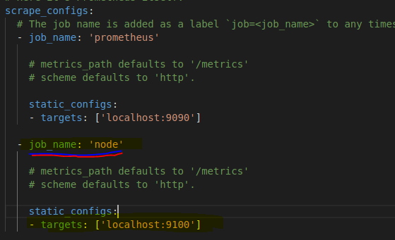
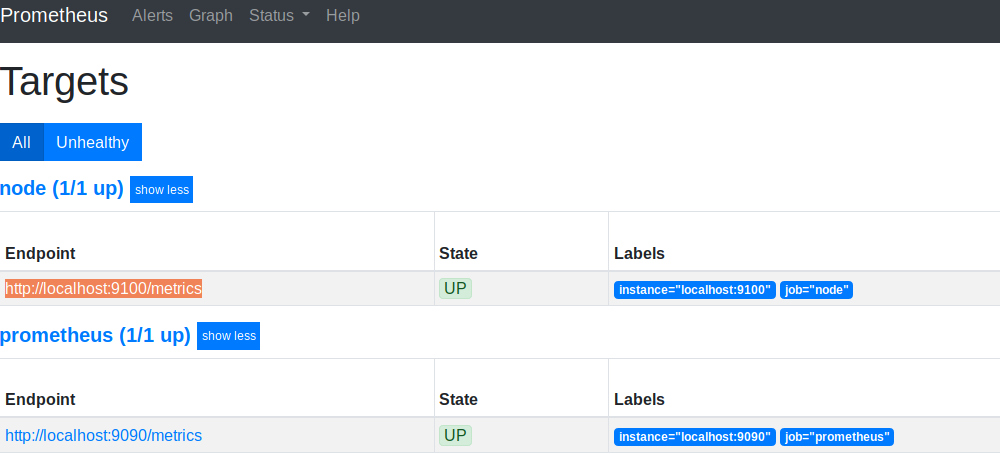

# 主机监控 -node_exporter

Exporter for machine metrics  [prometheus/node_exporter](https://github.com/prometheus/node_exporter)


## 安装 Prometheus

``` shell
sudo tar -zxvf prometheus-*.tar.gz -C /opt/prometheus/

cd /opt/prometheus/prometheus-*/

sudo ./prometheus --config.file=prometheus.yml --web.enable-lifecycle
```

解压后，在解压后的路径内执行命令./premetheus 即可以使用默认配置(prometheus.yml)启动Prometheus应用。

http://宿主机ip:9090 测试启动情况,但是由于没有配置exporter来导入数据，暂时是没有数据的。

## 安装 Node_exporter

node_exporter – 用于机器系统数据收集, 以Prometheus理解的格式导出大量指标（如磁盘I / O统计数据，CPU负载，内存使用情况，网络统计数据等）

mysqld_exporter – 用于MySQL服务器数据收集

prometheus可以理解为一个数据库+数据抓取工具，工具从各处抓来统一的数据，放入prometheus这一个时间序列数据库中。那如何保证各处的数据格式是统一的呢？就是通过这个exporter。

exporter也是用GO写的程序，它开放一个http接口，对外提供格式化的数据。所以在不同的环境下，需要编写不同的exporter。

```
#解压
sudo tar -zxvf node_exporter-0.16.0.linux-amd64.tar.gz -C /data/prometheus/

# 启动
sudo ./node_exporter &
```

```
curl 127.0.0.1:9100
curl 127.0.0.1:9100/metric   #会返回很多数据指标
```

修改prometheus.yml配置文件, 因为这里node_exporter和Prometheus安装在同一台机器,使用localhost即可，node_exporter端口9100



重启prometheus，点击导航栏中的status->targets可以看到



## 安装 grafana

```
Redhat & Centos(64 Bit)
wget https://dl.grafana.com/oss/release/grafana-6.2.5-1.x86_64.rpm
sudo yum localinstall grafana-6.2.5-1.x86_64.rpm

Ubuntu & Debian(64 Bit)
wget https://dl.grafana.com/oss/release/grafana_6.2.5_amd64.deb
sudo dpkg -i grafana_6.2.5_amd64.deb
```

启动grafana

    `sudo service grafana-server start`

访问grafana 

    http://<服务器IP>:3000

    默认用户名和密码： admin/admin


## 获取dashboard模板

下载地址:https://grafana.com/dashboards/1860

注: https://grafana.com/dashboards 还有很多的dashboard可以下载


可以直接写入1860，也可以再官网上下载json文件load上去
这样node_exporter获取的数据就能展示出来了

