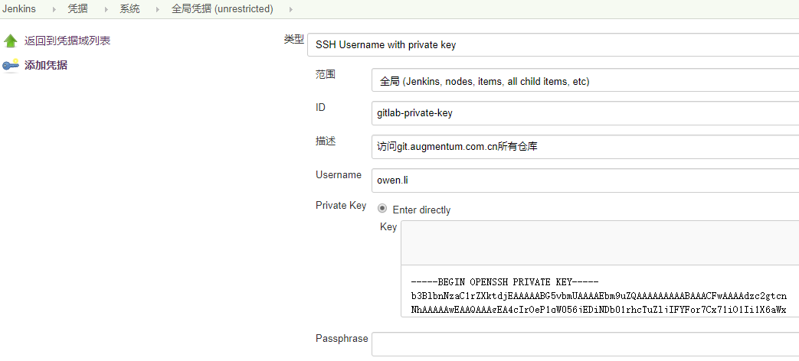

# Jenkins 凭证管理

许多三方网站和应用可以与Jenkins交互，如Artifact仓库，基于云的存储系统和服务等. 在Jenkins中添加/配置credentials，Pipeline项目就可以使用 credentials 与三方应用交互

## Credential 类型

https://jenkins.io/zh/doc/book/using/using-credentials/

Jenkins可以存储以下类型的credentials:

- Secret text - API token之类的token (如GitHub个人访问token),

- Username and password - 可以为独立的字段，也可以为冒号分隔的字符串：username:password(更多信息请参照 处理 credentials),

- Secret file - 保存在文件中的加密内容

- SSH Username with private key - SSH 公钥/私钥对,

- Certificate - a PKCS#12 证书文件 和可选密码

- Docker Host Certificate Authentication credentials.

## Credential 安全

为了最大限度地提高安全性，在Jenins中配置的 credentials 以加密形式存储在Jenkins 主节点上（用Jenkins ID加密），并且**只能通过 credentials ID**在Pipeline项目中获取

这最大限度地减少了向Jenkins用户公开credentials真实内容的可能性，并且阻止了将credentials复制到另一台Jenkins实例

## Credential 使用

存储在Jenkins中的credentials可以被使用：

1. 适用于Jenkins的任何地方 (即全局 credentials),

2. 通过特定的Pipeline项目/项目 (在 处理 credentials 和 使用Jenkinsfile部分了解更多信息),

3. 由特定的Jenkins用户 (如 Pipeline 项目中[创建 Blue Ocean](https://jenkins.io/zh/doc/book/blueocean/creating-pipelines/)的情况).
    - Blue Ocean 自动生成一个 SSH 公共/私有密钥对, 确保 SSH 公共/私有秘钥对在继续之前已经被注册到你的Git服务器

实际使用中，下面几个场景会用到creential

- gitlab 访问、API调用
- jenkins slave 创建

## Credential 创建

### Credential ID

- 在 ID 字段中，**必须**指定一个有意义的credential ID - 例如 jenkins-user-for-xyz-artifact-repository 。 

    注意: 该字段是可选的。 如果您没有指定值, Jenkins 则Jenkins会分配一个全局唯一ID（GUID）值。请记住，一旦设置了credential ID，就不能再进行更改。

#### 命名规则

- 为了便于管理和使用， 这里使用使用统一的约定来指定credential ID

- 原则上， @AugOpsTeam 成员不能随意创建 credential ID, 经过讨论后统一创建新的ID

- 建议使用类似下面的format做为credential ID， 便于jenkinsfile开发时直接使用，同时在”描述“里写清楚credential的作用

    **gitlab-api-token、gitlab-private-key、gitlab-userpwd-pair、harbor-xxx-xxx**

    

    
