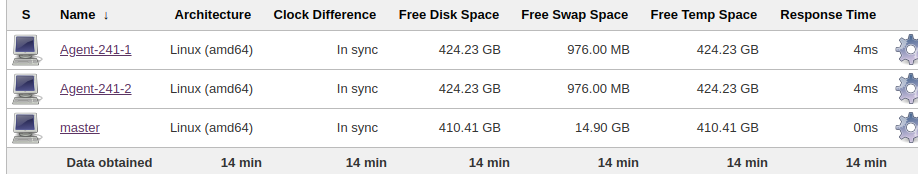
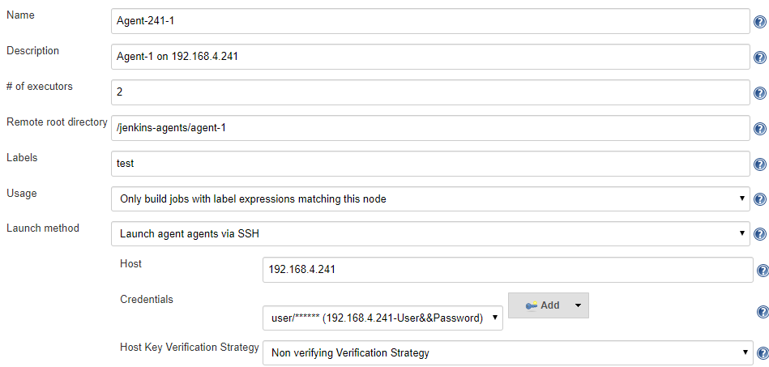

# Jenkins 分布式构建

## 分布式构建的作用

当一个持续集成系统非常庞大的时候，一台持续集成系统是无法完成大批量的job的，所以利用分布式的Jenkins应用就可以解决这样的问题

## 分布式构建的原理

对于jenkins的分布式框架，大家可以简单的理解为server-client模式，在jenkins中是Master-slave，也就是一个主的server叫Master，其他的子client都是slave

- Master的作用：负责分发job任务的。把job分配给某个或者某几个slave来工作。
- Slave的作用：负责干活的，也就是do job的。一个一个的客户端来真正运行Master给我们的任务。

## jenkins agent 配置及命名规则

1. 使用类似下面的format来命名新建agent, 这样便于分配agent，以及设别agent位置

    "**Agent-241-XXX**"  "**Agent-242-XXX**"

   

2. agent安装位置 （每台机器根目录下），并且每个agent单独创建folder，隔离agent workspace

    - /jenkins-agents/agent-1

    - /jenkins-agents/agent-2

3. Agent（Permanent）配置, 区别与dynamic agents

    

4. 根据项目需求，安装jenkins build依赖的组建，

    - docker/docker compose, java, maven, ...
