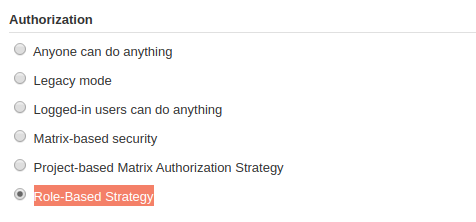
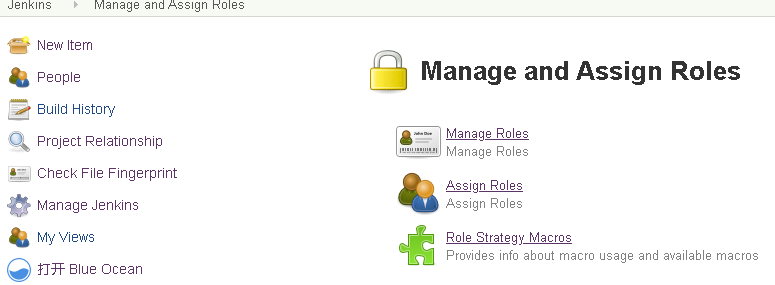
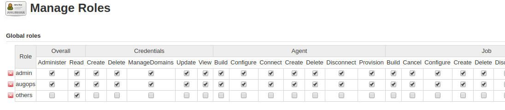
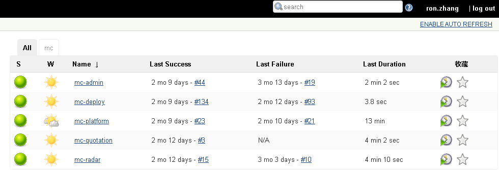
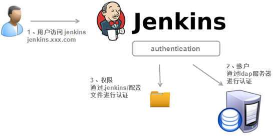

# Jenkins 权限管理

根据实际情况，我们采用以单个“项目”单位，每个项目有自己的view, 只能看到自己项目的jenkins job.

jenkins默认的权限管理体系不支持用户组或角色的配置，这里利用[Role-based Authorization Strategy](https://wiki.jenkins-ci.org/display/JENKINS/Role+Strategy+Plugin)实现上述目的

## 权限角色配置

直接跳过插件安装，介绍如何基于“项目”配置.

### 1. 启用 Role-based Authorization Strategy

进入系统管理 > Configure Global Security ,配置如下，此时该策略已启用

<font color='#ff0000'>注意</font>：策略启用之后，不禁止修改！策略之间是独立的，一旦选择另外一中策略，当前策略将丢失，包括已生效的配置。



### 2. 创建 Glabal roles 和 Project roles

进入系统管理 > Manage and Assign Roles



    ManageRoles
    - Global roles是对全局的角色控制，
    - Project roles只针对项目进行控制,所以需要为每个项目单独添加指定的role。



<font color='#ff0000'>注意</font>：必须先进行Global roles的配置后方可对Project roles进行配置，可以解为先配置整体性权限，再按项目分权限，遵守从大到小权限控制的原则！


### 3. roles 配置规则和流程

<font color='#ff0000'>这里强制规定群硕项目role配置规则和流程</font>

####  规则

1. 所有AugOps team成员都是 augops role（默认），可以管理整个jenkins (admin role暂时不使用)
2. 所有@DevTeam成员都是 others roles, 默认只有只读权限
3. 配置LADP之后，默认所有augmentum成员只能登录jenkins
4. AugOps team成员<font color='#ff0000'>禁止</font>随意改变Configure Global Security配置页下的授权策略,容易导致自己都登录不了

#### 3.1 为@DevTeam添加 project role

以“mc”项目为例，添加manager和user两种role

```text
    - role:mc-manager	- pattern: "^mc-[a-zA-Z]*"
    - role:mc-user      - pattern: "^mc-[a-zA-Z]*"
```

1. 一般为@DevTeam只创建两种role， 甚至一个都可以
2. pattern是通过“正则表达”匹配为项目创建的jenkins job, 所有命名需要规范，简单，一个表达式可以匹配多个项目拥有的job.这里参考"mc"项目

### 3.2 为@DevTeam成员分配 role

以“ron.zhang”为例，只是授予了"mc-manager" role,所以该用户账号下只能看到自己的"mc"项目




## 添加用户-LDAP

jenkins 默认可以手动添加用户，由于简单不做解释；这里重点说下企业内部使用LDAP来实现用户的统一管理，也就是说无须再次创建用户



需要使用[LDAP插件](https://wiki.jenkins-ci.org/display/JENKINS/LDAP+Plugin)，然后在Configure Global Security 页面进行配置，输入公司内部LDAP服务信息。


<font color='#ff0000'>注意</font>： 

1. jenkins 默认使用“Jenkins' own user database”,即自己本身的数据库，一旦切换，当前配置数据可能丢失，所以切忌随意修改该配置 ！

2. 在配置LDAP前，一定要记得开启匿名用户的 admin 权限，否则一旦配错，自己就无法登录了！

    