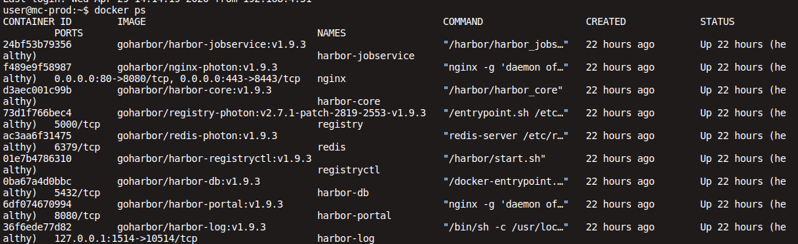
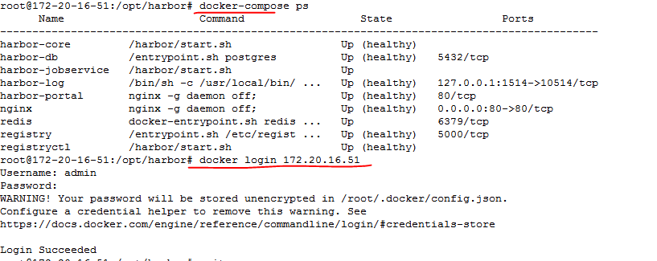
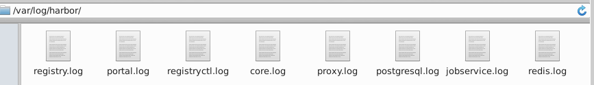
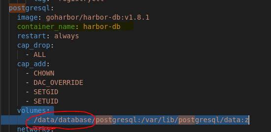

# Habor 安装

参考- [Installation and Configuration Guide](https://goharbor.io/docs/1.10/install-config/)

## 安装步骤

- docker/docker-compose 需提前安装

### 1. 下载 harbor 离线安装包

- 访问[harbor release page](https://github.com/goharbor/harbor/releases)，下载Harbor软件tgz压缩包

- 或执行如下命令下载Harbor软件tgz压缩包

    ``` shell
    wget https://storage.googleapis.com/harbor-releases/release-2.0.0/harbor-offline-installer-latest.tgz
    ```

- 解压tgz压缩包
  
    ``` shell
    tar xvf harbor-offline-installer-<version>.tgz
    ```

### 2. 配置 harbor.cfg （harbor.yml）

- 解压后文件在当前目录下的`harbor/`目录下

    ``` shell
    cd harbor/
    vim harbor.cfg
    harbor_admin_password = Harbor12345
    ```

### 3. 运行 `install.sh` 脚本来启动 Harbor

- 执行安装脚本 `./install.sh`

    ``` text
    #会拉取好几个镜像下来，及检查环境
    Note: docker version: 1.12.5
    Note: docker-compose version: 1.9.0

    [Step 0]: checking installation environment ...
    ....

    [Step 1]: loading Harbor images ...
    ....

    [Step 2]: preparing environment ...
    ....

    [Step 3]: checking existing instance of Harbor ...
    ....

    [Step 4]: starting Harbor ...

    ✔ ----Harbor has been installed and started successfully.----
    ...
    For more details, please visit https://github.com/vmware/harbor .
    ```

- 如果安装一切顺利，通过之前在harbor.cfg配置的hostname即可以访问到前端了.

    

- 执行 docker-compose ps (执行docker-compose需在包含docker-compose.yml（harbor自带该文件）的目录) , 确保 container 的状态都是up (healthy).

## Harbor安装问题

Harbor安装 之后，需要用docker-compose ps 命令去查看状态，保证所有docker 容器都是 healthy, 否则 很可能login harbor 失败



如果那个service 启动不正常，就去查看/var/log/harbor/ 下对应的log



---

### 问题-1

ubuntu@172-20-16-51:/opt/harbor$ docker login 172.20.16.51
Username: admin
Password:
Error response from daemon: login attempt to <http://172.20.16.51/v2/> failed with status: 502 Bad Gateway

Harbor-db  service 不能正常启动，最后查看postgresql.log 发现下面 message.

```text
 | initdb: directory "/var/lib/postgresql/data" exists but is not empty
 | If you want to create a new database system, either remove or empty
 | the directory "/var/lib/postgresql/data" or run initdb
 | with an argument other than "/var/lib/postgresql/data".
```

因为我当时的ubuntu 主机 /data/datebase  目录下，确实不是empty,  导致提示上面的错误。我手动改了docker-compose.yml ，添加了一个空目录。

然后 docker-compose up -d， 重新启动容器，服务正常



---

### 问题-2

```text
root@172-20-16-51:/opt/harbor# docker login 172.20.16.51:80
Username: admin
Password:
Error response from daemon: Get https://172.20.16.51:80/v2/: http: server gave HTTP response to HTTPS client
```

docker1.3.2版本开始默认docker registry使用的是https，Harbor默认安装使用的是HTTP协议，所以当执行用docker login、pull、push等命令操作非https的docker regsitry的时就会报错。解决办法：

- 如果系统是MacOS，则可以点击“Preference”里面的“Advanced”在“Insecure Registry”里加上hostname (e.g. docker.bksx.com)，重启Docker客户端就可以了。

- 如果系统是Ubuntu，则修改配置文件/lib/systemd/system/docker.service，修改[Service]下ExecStart参数，增加– insecure-registry hostname (e.g. docker.bksx.com)

- 如果系统是Centos，可以修改配置/etc/sysconfig/docker，将OPTIONS增加 –insecure-registry hostname (e.g. docker.bksx.com)

如果是新版本的docker在/etc/sysconfig/ 没有docker这个配置文件的情况下。

```text

#在daemon.json中添加以下参数
[root@localhost harbor]# cat /etc/docker/daemon.json
{
  "insecure-registries": [
    "hostname"
  ]
}
```

注意：该文件必须符合 json 规范，否则 Docker 将不能启动。另外hostname 必须与harbor.cfg 里的hostname 一致。

添加完了后重新启动 docker：
`systemctl daemon-reload && systemctl enable docker && systemctl restart docker`

修改harbor的运行配置，需要如下步骤：

```text
# 停止 harbor
 docker-compose down -v
# 修改配置
 vim harbor.cfg
# 执行./prepare已更新配置到docker-compose.yml文件
 ./prepare
# 启动 harbor
 docker-compose up -d
 ```
