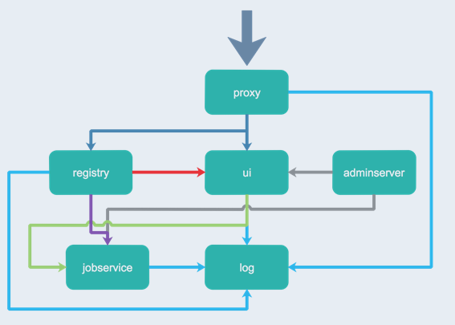

# Harbor

Docker容器应用的开发和运行离不开可靠的镜像管理，虽然Docker官方也提供了公共的镜像仓库，但是从安全和效率等方面考虑，部署我们私有环境内的Registry也是非常必要的。[Harbor](https://goharbor.io/) 是由VMware公司开源的企业级的Docker Registry管理项目，它包括权限管理(RBAC)、LDAP、日志审核、管理界面、自我注册、镜像复制和中文支持等功能。

Harbor 的所有组件都在 Dcoker 中部署，所以 Harbor 可使用 Docker Compose 快速部署。

注： 由于 Harbor 是基于 Docker Registry V2 版本，所以 docker 版本必须 > = 1.10.0 docker-compose >= 1.6.0

## Harbor核心组件解释

- Proxy：他是一个nginx的前端代理，代理Harbor的registry,UI, token等服务。-通过深蓝色先标识

- db：负责储存用户权限、审计日志、Dockerimage分组信息等数据。

- UI：提供图形化界面，帮助用户管理registry上的镜像, 并对用户进行授权。

- jobsevice：jobsevice是负责镜像复制工作的，他和registry通信，从一个registry pull镜像然后push到另一个registry，并记录job_log。通过紫色线标识

- Adminserver：是系统的配置管理中心附带检查存储用量，ui和jobserver启动时候回需要加载adminserver的配置。通过灰色线标识；

- Registry：镜像仓库，负责存储镜像文件。当镜像上传完毕后通过hook通知ui创建repository，上图通过红色线标识，当然registry的token认证也是通过ui组件完成。通过红色线标识

- Log：为了帮助监控Harbor运行，负责收集其他组件的log，供日后进行分析。过docker的log-driver把日志汇总到一起，通过浅蓝色线条标识
