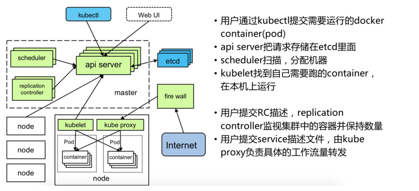

# Kubernetes 架构

Kubernetes集群由很多节点组成，分为两大类：

- 主节点(master) 承载Kubernetes控制和管理整个集群系统的控制面板
- 工作节点(node) 运行实际部署的应用

其中，Master节点上运行着集群管理相关的一组进程 etcd、API Server、Controller Manager、Scheduler，后三个组件构成了Kubernetes的总控中心，这些进程实现了整个集群的资源管理、Pod调度、弹性伸缩、安全控制、系统监控和纠错等管理功能，并且全都是自动完成。

在每个Node上运行Kubelet、Proxy、Docker daemon三个组件，负责对本节点上的Pod的生命周期进行管理，以及实现服务代理的功能。

## 执行过程

通过Kubectl提交一个创建RC的请求，该请求通过API Server被写入etcd中，此时 Controller Manager通过 API Server的监听资源变化的接口监听到这个RC事件，分析之后，发现当前集群中还没有它所对应的Pod实例，于是根据RC里的Pod模板定义生成一个Pod对象，通过API Server写入etcd，接下来，此事件被Scheduler发现，它立即执行一个复杂的调度流程，为这个新Pod选定一个落户的Node，然后通过API Server 将这一结果写入到etcd中，随后，目标Node上运行的Kubelet进程通过API Server监测到这个“新生的”Pod，并按照它的定义，启动该Pod并任劳任怨地负责它的下半生，直到Pod的生命结束。

随后，我们通过Kubectl提交一个新的映射到该Pod的Service的创建请求，Controller Manager会通过Label标签查询到相关联的Pod实例，然后生成Service的Endpoints信息，并通过API Server写入到etcd中，接下来，所有Node上运行的Proxy进程通过 API Server 查询并监听Service对象与其对应的Endpoints信息，建立一个软件方式的负载均衡器来实现Service 访问到 后端Pod的流量转发功能。

- etcd
用于持久化存储集群中所有的资源对象，如Node、Service、Pod、RC、Namespace等；API Server提供了操作etcd的封装接口API，这些API基本上都是集群中资源对象的增删改查及监听资源变化的接口。

- Controller Manager
集群内部的管理控制中心，其主要目的是实现Kubernetes集群的故障检测和恢复的自动化工作，比如根据RC的定义完成Pod的复制或移除，以确保Pod实例数符合RC副本的定义；根据Service与Pod的管理关系，完成服务的Endpoints对象的创建和更新；其他诸如Node的发现、管理和状态监控、死亡容器所占磁盘空间及本地缓存的镜像文件的清理等工作也是由Controller Manager完成的。

- 客户端通过Kubectl命令行工具 或 Kubectl Proxy来访问Kubernetes系统，在Kubernetes集群内部的客户端可以直接使用Kuberctl命令管理集群。

- Kubectl Proxy是API Server的一个反向代理，在Kubernetes集群外部的客户端可以通过Kubernetes Proxy来访问API Server
