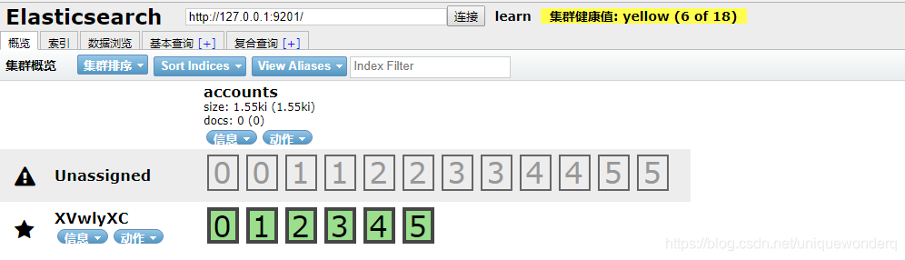
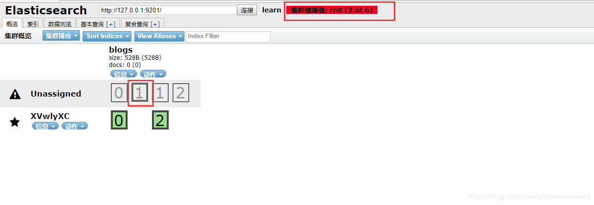

# ES 集群健康状态

[TOC]

查询健康状态 ` curl -XGET 'http://localhost:9200/_cluster/health?pretty' `

## 集群状态解读

a. 绿色——最健康的状态，代表所有的主分片和副本分片都可用；


b. 黄色——所有的主分片可用，但是部分副本分片不可用；



c. 红色——部分主分片不可用。（此时执行查询部分数据仍然可以查到，遇到这种情况，还是赶快解决比较好）



如果集群状态为红色， Head插件显示：集群健康值red 。则说明：至少一个主分片分配失败

## unassigned 分片

启动ES的时候，通过Head插件不停刷新，你会发现集群分片会呈现紫色、灰色、最终绿色的状态。

如果不能分配分片，例如，您已经为集群中的节点数过分分配了副本分片的数量，则分片将保持`UNASSIGNED`状态。
其错误码为：`ALLOCATION_FAILED`

可通过如下指令，查看集群中不同节点、不同索引的状态。

`curl -XGET 'http://localhost:9200/_cat/shards?h=index,shard,prirep,state,unassigned.reason'`

### 出现 unassigned 分片后的症状


通过“elasticsearch-head”插件查看后发现：Elasticsearch启动N长时候后，某一个或几个分片仍持续为灰色

### unassigned 分片问题可能的原因  

1）INDEX_CREATED：由于创建索引的API导致未分配。  
2）CLUSTER_RECOVERED ：由于完全集群恢复导致未分配。
3）INDEX_REOPENED ：由于打开open或关闭close一个索引导致未分配。  
4）DANGLING_INDEX_IMPORTED ：由于导入dangling索引的结果导致未分配。  
5）NEW_INDEX_RESTORED ：由于恢复到新索引导致未分配。  
6）EXISTING_INDEX_RESTORED ：由于恢复到已关闭的索引导致未分配。  
7）REPLICA_ADDED：由于显式添加副本分片导致未分配  8）ALLOCATION_FAILED ：由于分片分配失败导致未分配  
9）NODE_LEFT ：由于承载该分片的节点离开集群导致未分配  
10）REINITIALIZED ：由于当分片从开始移动到初始化时导致未分配（例如，使用影子shadow副本分片）  
11）REROUTE_CANCELLED ：作为显式取消重新路由命令的结果取消分配  
12）REALLOCATED_REPLICA ：确定更好的副本位置被标定使用，导致现有的副本分配被取消，出现未分配

### 集群状态红色如何排查

症状：集群健康值红色;
可能原因：集群中部分节点的主分片未分配。
接下来的解决方案主要围绕：使主分片unsigned 分片完成再分配展开

### 如何Fix unassigned 分片问题

**方案一**：极端情况——这个分片数据已经不可用，直接删除该分片。
ES中没有直接删除分片的接口，除非整个节点数据已不再使用，删除节点。

`curl -XDELETE ‘localhost:9200/index_name/’`

**方案二**：集群中节点数量 (N)>=集群中所有索引的最大副本数量 (R) +１。

根据我们的集群状态

- 节点数量=N：1
- 集群中所有索引的最大副本数量=R ：5

```json
{
  "cluster_name" : "go",
  "status" : "red",
  "timed_out" : false,
  "number_of_nodes" : 1,
  "number_of_data_nodes" : 1,
  "active_primary_shards" : 114,
  "active_shards" : 114,
  "relocating_shards" : 0,
  "initializing_shards" : 0,
  "unassigned_shards" : 397,
  "delayed_unassigned_shards" : 0,
  "number_of_pending_tasks" : 0,
  "number_of_in_flight_fetch" : 0,
  "task_max_waiting_in_queue_millis" : 0,
  "active_shards_percent_as_number" : 22.309197651663403
}
```

``` json
curl -XGET 'http://localhost:9200/_settings?pretty'
{
  "aug-config-2020.09.10" : {
    "settings" : {
      "index" : {
        "creation_date" : "1599696116279",
        "number_of_shards" : "5",
        "number_of_replicas" : "1",
        "uuid" : "nD1A7lcLS4KKw8EknarHPQ",
        "version" : {
          "created" : "6081199"
        },
        "provided_name" : "aug-config-2020.09.10"
      }
    }
  }
}
```

#### 知识点

当节点加入和离开集群时，主节点会自动重新分配分片，以确保分片的多个副本不会分配给同一个节点。换句话说，主节点不会将主分片分配给与其副本相同的节点，也不会将同一分片的两个副本分配给同一个节点。  

如果没有足够的节点相应地分配分片，则分片可能会处于未分配状态。就像下面这种，是一种健康的状态。N=4,R=1


#### 解决方案

由于单机部署集群就一个节点，即Ｎ＝１；所以Ｒ＝０，才能满足公式。

问题就转嫁为：

1. 添加节点处理，即Ｎ增大；
2. 删除副本分片，即R置为0。

R置为0的方式，可以通过如下命令行实现：

``` shell
curl -XPUT 'http://localhost:9200/index_name/_settings' -H 'content-Type:application/json' -d'
{
  "number_of_replicas": 0
}'  
```

但是索引很多的情况下，就全局设置个数。如果索引比较多的话，执行可能会耗时一些

``` shell
curl -XPUT 'http://localhost:9200/_settings' -H 'content-Type:application/json' -d'
{
  "number_of_replicas": 0
}'
```

如果集群中的某些分片仍未分配，可通过如下命令 得到集群中分片分配的说明

`curl -XGET localhost:9200/_cluster/allocation/explain?pretty`

下面这个是因为空间不足

```json
{
  "index" : "dev_index",
  "shard" : 4,
  "primary" : true,
  "current_state" : "unassigned",
  "unassigned_info" : {
    "reason" : "ALLOCATION_FAILED",
    "at" : "2019-08-29T07:42:19.838Z",
    "failed_allocation_attempts" : 5,
    "details" : "failed to create shard, failure FileSystemException[/home/elasticsearch-5.4.1/data/nodes/0/indices/LOJ1KI0xQouDy6iwLeHtkw: No space left on device]",
    "last_allocation_status" : "no"
  },
  "can_allocate" : "no",
  "allocate_explanation" : "cannot allocate because allocation is not permitted to any of the nodes",
  "node_allocation_decisions" : [
    {
      "node_id" : "E0_rcL8US_OIyPBJVmKHYA",
      "node_name" : "dev205",
      "transport_address" : "12.17.61.205:9300",
      "node_decision" : "no",
      "weight_ranking" : 1,
      "deciders" : [
        {
          "decider" : "max_retry",
          "decision" : "NO",
          "explanation" : "shard has exceeded the maximum number of retries [5] on failed allocation attempts - manually call [/_cluster/reroute?retry_failed=true] to retry, [unassigned_info[[reason=ALLOCATION_FAILED], at[2019-08-29T07:42:19.838Z], failed_attempts[5], delayed=false, details[failed to create shard, failure FileSystemException[/home/elasticsearch-5.4.1/data/nodes/0/indices/LOJ1KI0xQouDy6iwLeHtkw: No space left on device]], allocation_status[deciders_no]]]"
        }
      ]
    }
  ]
}
```

下面这个单机环境下没有足够节点进行分片

```json
{
  "index" : "aug-database-2020.08.28",
  "shard" : 1,
  "primary" : false,
  "current_state" : "unassigned",
  "unassigned_info" : {
    "reason" : "CLUSTER_RECOVERED",
    "at" : "2020-09-15T00:39:23.452Z",
    "last_allocation_status" : "no_attempt"
  },
  "can_allocate" : "no",
  "allocate_explanation" : "cannot allocate because allocation is not permitted to any of the nodes",
  "node_allocation_decisions" : [
    {
      "node_id" : "iK83cGqrQNiY8vCPiUIhoA",
      "node_name" : "iK83cGq",
      "transport_address" : "172.18.0.4:9300",
      "node_attributes" : {
        "ml.machine_memory" : "16735551488",
        "xpack.installed" : "true",
        "ml.max_open_jobs" : "20",
        "ml.enabled" : "true"
      },
      "node_decision" : "no",
      "deciders" : [
        {
          "decider" : "same_shard",
          "decision" : "NO",
          "explanation" : "the shard cannot be allocated to the same node on which a copy of the shard already exists [[aug-database-2020.08.28][1], node[iK83cGqrQNiY8vCPiUIhoA], [P], s[STARTED], a[id=HVK1QMJGRkuHDq6m71O_Ew]]"
        }
      ]
    }
  ]
}
```

对于索引出现Unassigned 的情况，最好的解决办法是reroute, 如果不能reroute，则考虑重建分片，通过number_of_replicas的修改进行恢复。如果上述两种情况都不能恢复，则考虑reindex。
