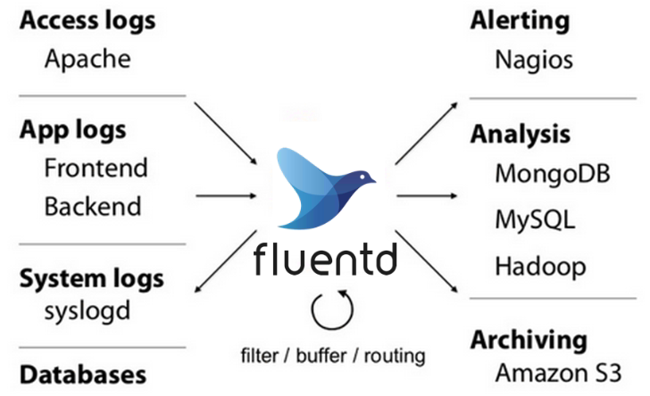

# Fluentd

[Fluentd](https://www.fluentd.org/architecture)是一个开源的数据收集器，专为处理数据流设计，有点像 syslogd ，但是使用JSON作为数据格式。它采用了插件式的架构，具有高可扩展性高可用性，同时还实现了高可靠的信息转发。Fluentd是由Fluent+d得来，d生动形象地标明了它是以一个守护进程的方式运行。

使用上，我们可以把各种不同来源的信息，首先发送给Fluentd，接着Fluentd根据配置通过不同的插件把信息转发到不同的 地方，比如文件、SaaS Platform、数据库，甚至可以转发到另一个Fluentd

The following article gives a general overview of how events are processed by Fluentd with examples. It covers the complete lifecycle including Setup, Inputs, Filters, Matches and Labels

- <https://docs.fluentd.org/quickstart/life-of-a-fluentd-event>

## 特点

Fluentd不负责生产数据、不负责存储数据，只是数据的搬运工。

• 使用JSON进行统一日志记录：Fluentd尝试尽可能地将数据结构化为JSON：这允许Fluentd 统一处理日志数据的所有方面：收集，过滤，缓冲和跨多个源和目标（统一日志层）输出日志。使用JSON可以更轻松地进行下游数据处理，因为它具有足够的结构，可以在保留灵活模式的同时进行访问。

• 可插拔架构：Fluentd拥有灵活的插件系统，允许社区扩展其功能。500多个社区贡献插件连接了数十个数据源和数据输出。通过利用插件，您可以立即开始更好地使用日志。

• 所需的资源较少： Fluentd是用`C语言和Ruby组合编写`的，只需要很少的系统资源。vanilla实例运行30-40MB内存，可处理13,000个事件/秒/核心。

• 内置可靠性：Fluentd支持基于内存和文件的缓冲，以防止节点间数据丢失。Fluentd还支持强大的故障转移功能，可以设置为高可用性。

## td-agent

td-agent是Fluentd的稳定发行版本，它的出现是因为Fluentd不易于安装。本质上td-agent和Fluentd是一个东西。

Fluentd is written in Ruby for flexibility, with performance sensitive parts written in C. However, some users may have difficulty installing and operating a Ruby daemon.

That’s why [Treasure Data, Inc](https://www.treasuredata.com/) is providing the stable distribution of Fluentd, called **td-agent**. The differences between Fluentd and td-agent can be found [here](https://www.fluentd.org/faqs).

## 安装

- <https://docs.fluentd.org/installation>

### 容器部署

- <https://docs.fluentd.org/container-deployment/install-by-docker>
