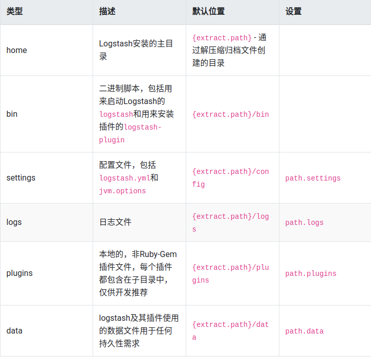
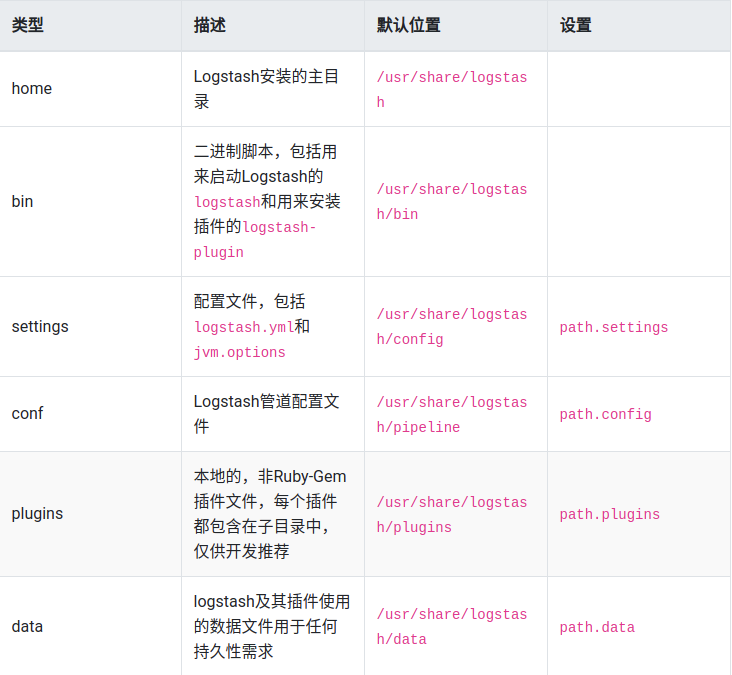
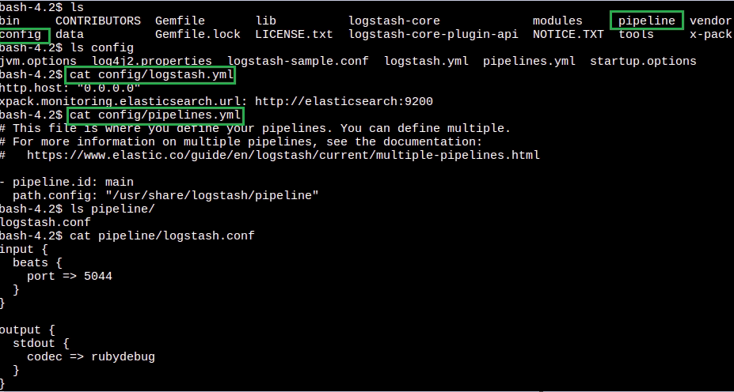

# Logstash-目录结构

**注意：** 了解目录结构，有助于进行标准化的配置，以及容器挂载路径设置

## .zip和.tar.gz归档目录布局

.zip和.tar.gz包是完全独立的，默认情况下，所有文件和目录都包含在主目录中——主目录是在解压缩归档文件时创建的目录。

这非常方便，因为你不必创建任何目录来开始使用Logstash，卸载Logstash就像删除主目录一样简单，但是，建议更改配置和日志目录的默认位置，以便以后不删除重要数据。

## Debian和RPM包的目录布局

Debian软件包和RPM软件包为系统每个地方配置文件、日志和设置文件在适当的位置：

## Docker镜像的目录布局

Docker镜像是由.tar.gz包创建的，并遵循类似的目录布局。

Logstash Docker容器在默认情况下不会创建日志文件，它们记录到标准输出。

