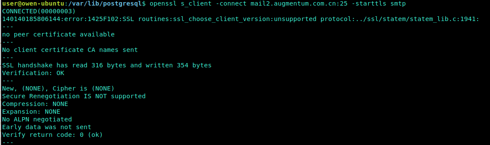

# AlertManager

Alertmanager 主要用于接收 Prometheus 发送的告警信息，它支持丰富的告警通知渠道，而且很容易做到告警信息进行**去重，降噪，分组，策略路由**，是一款前卫的告警通知系统.

注:Grafana 的报警功能目前还比较弱，只支持 Graph 的图表的报警

## AlertManager安装

- https://github.com/prometheus/alertmanager

`$ ./alertmanager --config.file=simple.yml  // -config.file 参数是用来指定对应的配置文件`

## 概念

> 在实际运维过程中，我们都会遇到，报警的重复发送，以及报警信息关联性报警,通过下面的机制可以对告警信息进行收敛

### 告警分组

分组是指将同一类型的警报分类为单个通知。当许多系统同时宕机时，很有可能成百上千的警报会同时生成，这种机制特别有用。
例如，当数十或数百个服务的实例在运行，网络发生故障时，有可能一半的服务实例不能访问数据库。在prometheus告警规则中配置为每一个服务实例都发送警报的话，那么结果是数百警报被发送至Alertmanager。

但是作为用户只想看到单一的报警页面，同时仍然能够清楚的看到哪些实例受到影响，因此，可以通过配置Alertmanager将警报分组打包，并发送一个相对看起来紧凑的通知。

**报警分组，可以有效减少告警邮件数，但是仅是在同一个时间段报警，同一个组的告警信息才会合并发送**

### Inhibition(抑制)

抑制是指当警报发出后，停止重复发送由此警报引发其他错误的警报的机制。(比如网络不可达，服务器宕机等灾难性事件导致其他服务连接相关警报)

例如，当整个集群网络不可达，此时警报被触发，可以事先配置Alertmanager忽略由该警报触发而产生的所有其他警报，这可以防止通知数百或数千与此问题不相关的其他警报。

### Silences(静默)

Silences是一种简单的**特定时间不告警**的机制。silences警告是通过匹配器(matchers)来配置，就像路由树一样。传入的警报会匹配RE，如果匹配，将不会为此警报发送通知。

silences报警机制可以通过Alertmanager的Web页面进行配置。

## AlertManager配置

[参考 alertmanager.yml](http://git.augmentum.com.cn/AugCI/knowledgebase/blob/master/%E7%9B%91%E6%8E%A7/Prometheus/config/alertmanager.yml)

- 全局配置
- 分组
- 去重
- 降噪
- 告警路由配置


### 通过Email接收警告

目前公司内部邮箱由于没有配置TLS，所以alert触发后无法发送邮件 (see errors below)

> As stated in the SMTP godoc, the library will allow plain authentication only if TLS is used or the server is local. So you'll have to fulfill one of the conditions to make it work. I'm afraid there's nothing much that can be done on the AlertManager's side.

```
level=error ts=2020-06-11T03:18:22.910Z caller=notify.go:372 component=dispatcher msg="Error on notify" err="*smtp.plainAuth auth: unencrypted connection" context_err="context deadline exceeded"

level=error ts=2020-06-11T03:18:22.910Z caller=dispatch.go:301 component=dispatcher msg="Notify for alerts failed" num_alerts=1 err="*smtp.plainAuth auth: unencrypted connection"

```



## 通过企业微信接收告警

Alertmanger 从 v0.12 开始已经默认支持企业微信了

- step 1: 访问[网站](https://work.weixin.qq.com/) 注册企业微信账号（不需要企业认证）。
- step 2: 访问apps 创建第三方应用，点击创建应用按钮 -> 填写应用信息

### 详细配置

```
prometheus 配置：
# Alertmanager configuration
alerting:
  alertmanagers:
  - static_configs:
    - targets:
      - localhost:9093

rule_files:
  - "rules.yml"

scrape_configs:
  - job_name: 'node'
    static_configs:
      - targets: ['localhost:9100']
rules.yml 配置：
groups:
- name: node
  rules:
  - alert: server_status
    expr: up{job="node"} == 0
    for: 15s
    annotations:
      summary: "机器 {{ $labels.instance }} 挂了"
alertmanger 配置：
route:
  group_by: ['alertname']
  receiver: 'wechat'

receivers:
- name: 'wechat'
  wechat_configs:
  - corp_id: 'xxx'
    to_party: '1'
    agent_id: '1000002'
    api_secret: 'xxxx'
```

参数说明：

- corp_id: 企业微信账号唯一 ID， 可以在我的企业中查看。
- to_party: 需要发送的组。
- agent_id: 第三方企业应用的 ID，可以在自己创建的第三方企业应用详情页面查看。
- api_secret: 第三方企业应用的密钥，可以在自己创建的第三方企业应用详情页面查看。

详情请参考[文档](https://work.weixin.qq.com/api/doc/90000/90135/90236#%E6%96%87%E6%9C%AC%E6%B6%88%E6%81%AF)

