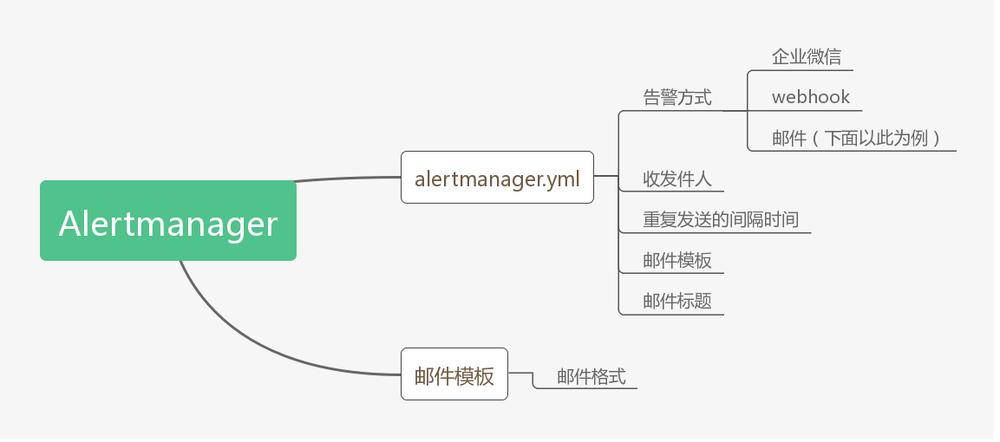

# Prometheus

## Docker部署Prometheus

```
docker run \
    --name prometheus \
    -p 9090:9090 \
    -d \
    -v /opt/mount/prometheus/data/:/prometheus \
    -v /opt/mount/prometheus/config/:/etc/prometheus/ \
    prom/prometheus
```

## Docker部署AlertManager

```
docker run -d \
    --name alertmanager \
    -p 9093:9093 \
    -v /opt/mount/alertmanager/config/:/etc/alertmanager/ \
    -v /opt/mount/alertmanager/data/:/alertmanager \
    prom/alertmanager:latest

```

## Prometheus和Alertmanager的关系

由于Prometheus和Alertmanager是协同作战，所以先了解一下它们各自的职责，下面简单的列了两张图



