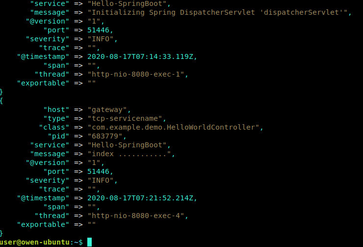

# ELK + Spring cloud

logstash有许多种接受数据的方式，这里尝试两种

1. 将springcloud微服务应用使用logstash-logback-encoder通过TCP方式传送到elk的logstash上
2. 还有就是使用redis作为消息队列对日志数据做一个中转

## ELK 部署

## 示例

部署前，强烈建议先了解下[Logstash-目录结构](../../Log_Collectors/Logstash/Logstash-目录结构.md#Docker镜像的目录布局)

### TCP方式（logback）

#### 1. Logstash 配置

`mkdir -p /data/logstash/config  /data/logstash/pipeline/`

- 在`/data/logstash/config`下然后创建下列文件

  - logstash.yml (内容可为空)

        ```yml
        config:
        reload:
            automatic: true
            interval: 3s
        xpack:
        management.enabled: false
        monitoring.enabled: false
        ```

  - log4j2.properties

        ```
        logger.elasticsearchoutput.name = logstash.outputs.elasticsearch
        logger.elasticsearchoutput.level = debug
        ```

  - pipelines.yml

        ``` yaml
        - pipeline.id: logstash_tcp
        path.config: "/usr/share/logstash/pipeline/logstash_tcp.conf"
        ```

- 在`/data/logstash/pipeline`下然后创建下列文件

  - logstash_tcp.conf
    表示开发环境的logs有多个环境可以创建多个文件进行指定配置同步到容器执行即可

        ```json
        input {
        tcp {
            mode => "server"
            host => "0.0.0.0"
            port => 5040  //Logstash 日志接收接口
            codec => json_lines
        }
        }
        filter{
        }
        output {
            elasticsearch {
            hosts => "127.0.0.1:9200"
            index => "logstash_tcp-%{+YYYY.MM.dd}"
            }
            stdout { codec => rubydebug }
        }
        ```

#### 2. SpringCloud代码配置

- pom文件添加依赖

    ```xml
    <dependency>
        <groupId>net.logstash.logback</groupId>
        <artifactId>logstash-logback-encoder</artifactId>
        <version>5.1</version>
    </dependency>
    ```

- 配置 logback-spring.xml

    ``` xml
    <?xml version="1.0" encoding="UTF-8"?>
    <!--该日志将日志级别不同的log信息保存到不同的文件中 -->
    <configuration>
        <!-- 引入默认的日志格式设置。里面包含CONSOLE的日志格式了 -->
        <!-- <include resource="org/springframework/boot/logging/logback/defaults.xml" /> -->
        <springProperty scope="context" name="springAppName" source="spring.application.name" />

        <!-- 日志在工程中的输出位置 -->
        <property name="LOG_FILE" value="${BUILD_FOLDER:-build}/${springAppName}" />

        <!-- 控制台的日志输出样式 -->
        <property name="CONSOLE_LOG_PATTERN"
                value="%clr(%d{yyyy-MM-dd HH:mm:ss.SSS}){faint} %clr(${LOG_LEVEL_PATTERN:-%5p}) %clr(${PID:- }){magenta} %clr(---){faint} %clr([%15.15t]){faint} %m%n${LOG_EXCEPTION_CONVERSION_WORD:-%wEx}}" />

        <!-- 控制台输出 -->
        <appender name="console" class="ch.qos.logback.core.ConsoleAppender">
            <filter class="ch.qos.logback.classic.filter.ThresholdFilter">
                <level>INFO</level>
            </filter>
            <!-- 日志输出编码 -->
            <encoder>
                <pattern>${CONSOLE_LOG_PATTERN}</pattern>
                <charset>utf8</charset>
            </encoder>
        </appender>

        <!-- 为logstash输出的JSON格式的Appender -->
        <appender name="logstash"
                class="net.logstash.logback.appender.LogstashTcpSocketAppender">
            <!-- destination的节点是logstash安装的目标机器,这里的端口号需要跟Logstash监听的端口号一致，这里是5040 -->
            <destination>127.0.0.1:5040</destination>
            <!-- 日志输出编码 -->
            <encoder
                    class="net.logstash.logback.encoder.LoggingEventCompositeJsonEncoder">
                <providers>
                    <timestamp>
                        <timeZone>UTC</timeZone>
                    </timestamp>
                    <pattern>
                        <pattern>
                            {
                            "severity": "%level",
                            "service": "${springAppName:-}",
                            "trace": "%X{X-B3-TraceId:-}",
                            "span": "%X{X-B3-SpanId:-}",
                            "exportable": "%X{X-Span-Export:-}",
                            "pid": "${PID:-}",
                            "thread": "%thread",
                            "class": "%logger{40}",
                            "message": "%message"
                            }
                        </pattern>
                    </pattern>
                </providers>
            </encoder>
        </appender>

        <!-- 日志输出级别 -->
        <root level="INFO">
            <appender-ref ref="console" />
            <appender-ref ref="logstash" />
        </root>
    </configuration>
    ```

- 代码部分

    

#### 3. 验证结果

- 启动工程，日志就被发送到logstash
    

- 根据logstash_tcp.conf配置，数据同时发送到ElasticSearch
    

- 访问localhost:5601可以进入kibana界面--->配置pattern,输入*，匹配所有数据,选择时间@timestamp，这样数据展示会以时间排序,点击discover
    

### Redis方式

Redis 服务器是 logstash 官方推荐的 broker 选择。

#### Logstash 配置

    ``` json
    input {
    redis {
    codec => json
    host => "192.168.2.246"
    port => 56379
    key => "data-mgr"
    data_type => "list"
    }
    }
    ```

#### SpringCloud 代码配置

- pom文件中添加依赖
  
    ```xml
    <dependency>
    <groupId>com.cwbase</groupId>
    <artifactId>logback-redis-appender</artifactId>
    <version>1.1.5</version>
    </dependency>
    ```

- LOGSTASH的appender换成

    ```xml
    <appender name="LOGSTASH" class="com.cwbase.logback.RedisAppender">
        <source>mySource</source>
        <sourcePath>mySourcePath</sourcePath>
        <type>appName</type>
        <tags>dev</tags>
        <host>127.0.0.1</host>
        <port>56379</port>
        <key>data-mgr</key>
    </appender>
    ```

- 一般考虑到性能上的影响，日志使用异步的方式发送到redis，再添加一个异步的appender

    ```xml
    <appender name="ASYNC" class="ch.qos.logback.classic.AsyncAppender">
            <appender-ref ref="LOGSTASH" />
        </appender>
        <!-- 日志输出级别 -->
        <root level="INFO">
            <appender-ref ref="console" />
            <appender-ref ref="ASYNC" />
        </root>
    ```
