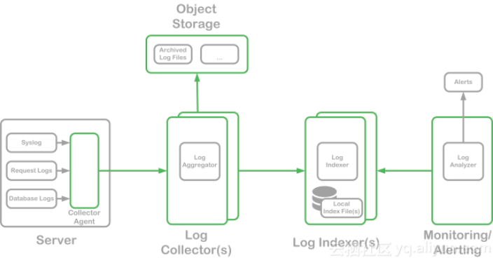

# 日志分析方案

一般我们需要进行日志分析场景：直接在日志文件中 grep、awk 就可以获得自己想要的信息。但在规模较大的场景中，此方法效率低下，面临问题包括日志量太大如何归档、文本搜索太慢怎么办、如何多维度查询。需要集中化的日志管理，所有服务器上的日志收集汇总。常见解决思路是建立集中式日志收集系统，将所有节点上的日志统一收集，管理，访问。

一般大型系统是一个分布式部署的架构，不同的服务模块部署在不同的服务器上，问题出现时，大部分情况需要根据问题暴露的关键信息，定位到具体的服务器和服务模块，构建一套集中式日志系统，可以提高定位问题的效率。

一个完整的集中式日志系统，需要包含以下几个主要特点：

- 收集－能够采集多种来源的日志数据
- 传输－能够稳定的把日志数据传输到中央系统
- 存储－如何存储日志数据
- 分析－可以支持 UI 分析
- 警告－能够提供错误报告，监控机制

## ELK/EFK日志分析平台

1. Elasticsearch
开源分布式搜索引擎，提供存储、分析、搜索功能。特点：分布式、基于reasful风格、支持海量高并发的准实时搜索场景、稳定、可靠、快速、使用方便等。接收搜集的海量结构化日志数据，并提供给kibana查询分析。

2. Logstash
开源日志搜集、分析、过滤框架，支持多种数据输入输出方式。 用于收集日志，对日志进行过滤形成结构化数据，并转发到elasticsearch中。

3. Filebeat
Filebeat是一个日志文件托运工具，在你的服务器上安装客户端后，filebeat会监控日志目录或者指定的日志文件，追踪读取这些文件（追踪文件的变化，不停的读）

4. Kibana
开源日志报表系统，对elasticsearch以及logstash有良好的web页面支持。对elasticsearch提供的数据进行分析展示