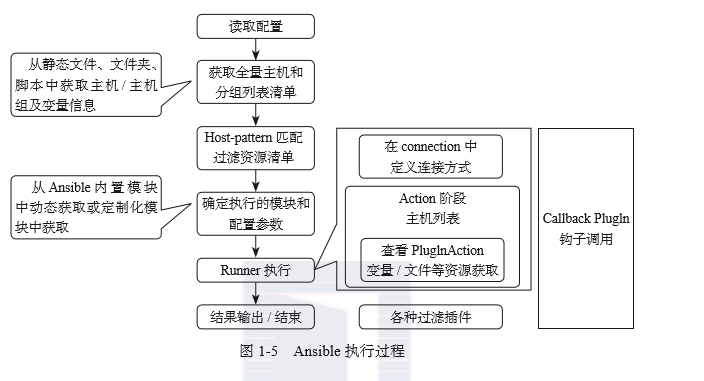

# Ansible is Simple IT Automation

这个工具的目标有这么几项：让我们自动化部署APP；自动化管理配置项；自动化的持续交付；自动化的（AWS）云服务管理。
所有的这几个目标本质上来说都是在一个台或者几台服务器上，执行一系列的命令而已,批量的在远程服务器上执行命令。

官网
<https://www.ansible.com/>

Ansible中文权威指南
<http://ansible-tran.readthedocs.io/en/latest/>

Ansible自动化运维教程
<https://www.w3cschool.cn/automate_with_ansible/>

ansible是一个非常简单的自动化部署项目，由python编写并且开源。用于提供自动化云配置、配置文件管理、应用部署、服务编排和很多其他的IT自动化需求。

ansible实现的自动化部署是多层次的，通过描述系统之间的逻辑关系来构建业务所需要的基础架构模型，而不仅仅用于管理一个单独的系统；也就是说ansible不仅仅能部署一个或多个独立的服务，它还能对这些服务做关联、对部署顺序做编排等，一个完美的ansible部署项目应该是层次分明、顺序有秩的。

另外，ansible是**Serverless**和**Agentless**项目，在部署工具准备阶段基本上是零成本，而且ansible使用**YAML**写playbooks，这使playbook看起来通俗易懂，一目了然。

ansible是**基于模块工作**的，本身没有批量部署的能力。真正具有批量部署的是ansible所运行的模块，ansible只是提供一种框架。

**主要包括：**

1. 连接插件connection plugins：负责和被监控端实现通信;
2. host inventory：指定操作的主机，是一个配置文件里面定义监控的主机；
3. 各种模块核心模块、command模块、自定义模块；
4. 借助于插件完成记录日志邮件等功能；
5. playbook：剧本执行多个任务时，非必需可以让节点一次性运行多个任务。

## Ansible 工作机制

+ Core Modules 
Ansible核心模块，ansible中模块就是用来指定对远程主机具体的操作，比如执行命令模块command、创建文件模块file等（ansible自带的模块）。

+ Custom Modules 
自定义模块，如果核心模块不足以完成某种功能就可以使用任何语言自定义模块。

+ Plugins 
第三方插件支持，如email、logging模块，只要有Python编写能力就可以自行编写插件。

+ Connection Plugins
控制节点与被纳管节点的通讯插件，linux系统默认使用SSH进行通讯。

+ Inventory
一个文件（INI类型）或者目录，主要作用是配置被纳管的主机和主机组，
如果是目录也可以放置组变量group_vars和主机变量host_vars

+ Playbooks
用于存放play，每个play可以对指定的主机或主机组进行批量的部署动作，上面说到的服务的部署、关联、编排就是在playbook内实现的。

>ansible 的概念比喻：
    >>1. playbook: 总剧本
    >>2. roles: 演员
    >>3. inventory: 舞台
    >>4. tasks: 分剧本
    >>5. vars/templates: 道具

因此，每次执行一个 playbook，就是要求 roles（演员）去到指定的舞台（inventory），使用 vars/templates 道具，表演一个个的 tasks（分剧本）。

## 功能特性

1. no agents：不需要在被管控主机上安装任何客户端；只需在主控端部署 Ansible 环境，被控端无需做任何操作
2. no server：无服务器端，使用时直接运行命令即可；
3. modules in any languages：基于模块工作，可使用任意语言开发模块；
4. yaml，not code：使用yaml语言定制剧本playbook；
5. ssh by default：基于SSH工作；
6. strong multi-tier solution：可实现多级指挥,支持云计算、大数据平台（如AWS、OpenStack、VMWare等）环境。

+ 批量任务执行可以写成脚本，不用分发到远程就可以执行。

+ **缺点** - 对Windows 兼容性很差

## Ansible 执行过程

Refer to <https://www.linuxprobe.com/ansible-formwork-2.html> 
