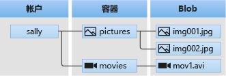

# Azure Blob

Azure Blob 存储是 Microsoft 提供的适用于云的对象存储解决方案。 Blob 存储最适合存储巨量的非结构化数据。非结构化数据是不遵循特定数据模型或定义的数据（如文本或二进制数据）。

- <https://docs.microsoft.com/zh-cn/azure/storage/blobs/storage-blobs-introduction>

Blob 存储提供了三种类型的资源：

- 存储帐户
- 存储帐户中的容器
- 容器中的 Blob

## 快速入门：使用 Azure 门户上传、下载和列出 Blob

- <https://docs.microsoft.com/zh-cn/azure/storage/blobs/storage-quickstart-blobs-portal>

## 在 Azure 存储中托管静态网站

- <https://docs.microsoft.com/zh-cn/azure/storage/blobs/storage-blob-static-website-how-to?tabs=azure-portal>

### 将静态网站与 Azure CDN 集成

- <https://docs.microsoft.com/zh-cn/azure/storage/blobs/static-website-content-delivery-network>