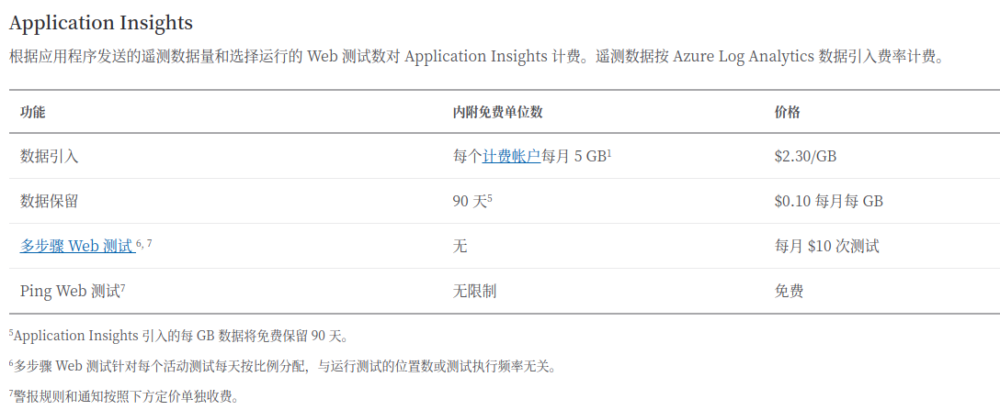

# Azure Monitor

- <https://docs.microsoft.com/zh-cn/azure/azure-monitor/>

[TOC]

## 概述

下图提供了 Azure Monitor 的概要视图。 示意图的中心是用于指标和日志（Azure Monitor 使用的两种基本类型的数据）的数据存储。 左侧是用于填充这些数据存储的监视数据源。 右侧是 Azure Monitor 针对这些收集的数据执行的不同功能，例如分析、警报和流式传输到外部系统。

Azure Monitor 收集的所有数据属于以下两种基本类型之一：`指标` 和 `日志`

## Application Insights

## 通知操作

### 通用警报架构

- <https://docs.microsoft.com/zh-cn/azure/azure-monitor/platform/alerts-common-schema>

通用警报架构将目前 Azure 中的警报通知的使用体验进行了标准化。 从历史上看，目前 Azure 中的三种警报类型（指标、日志、活动日志）一直有其自己的电子邮件模板、Webhook 架构等。现在，使用通用警报架构时可以收到架构一致的警报通知

以下警报类型默认支持通用架构（不需选择加入）：

- 智能检测警报

以下警报类型目前不支持通用架构：

- 由用于 VM 的 Azure Monitor 生成的警报
- 由 Azure 成本管理生成的警报

#### 报警类型

- SMS  
  一个适用于所有警报类型的一致的 SMS 模板。
- Email  
  一个一致且详细的电子邮件模板，可以轻松快捷地诊断问题。 嵌入式深度链接指向门户中的警报实例和受影响的资源，确保你可以快速跳转到修正过程。
- Webhook/逻辑应用/Azure Functions/自动化 Runbook
  一个适用于所有警报类型的一致的 JSON 结构，用于轻松地跨不同警报类型构建集成。

### 操作组中的短信通知行为

即收到警告短信后，可以选择是否订阅这个警告

- <https://docs.microsoft.com/zh-cn/azure/azure-monitor/platform/alerts-sms-behavior>

### 语音、短信、电子邮件、Azure 应用推送通知和 webhook 帖子的速率限制

- <https://docs.microsoft.com/zh-cn/azure/azure-monitor/platform/alerts-rate-limiting>
  
### 排查 Azure Monitor 警报的问题

- <https://docs.microsoft.com/zh-cn/azure/azure-monitor/platform/alerts-troubleshoot>

### Azure Monitor 限制

- <https://docs.microsoft.com/zh-cn/azure/azure-resource-manager/management/azure-subscription-service-limits#azure-monitor-limits>

### Auzure Monitor 定价

- <https://azure.microsoft.com/zh-cn/pricing/details/monitor/>

