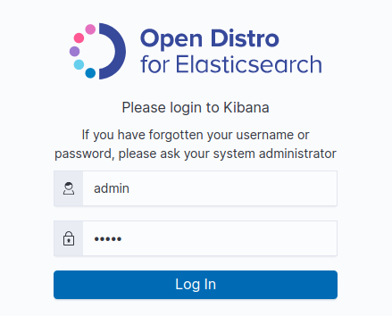
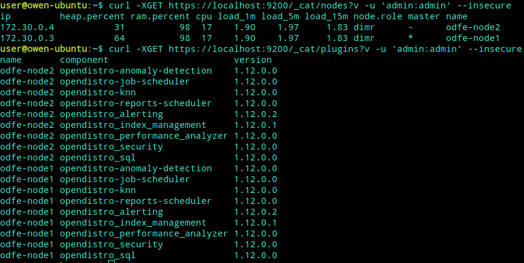

# Open Distro for Elasticsearch

这是 Elasticsearch 的一个增值发行版，100% 开源（采用 Apache 2.0 许可证）并且由 AWS 提供支持。（另请参阅 Jeff Barr 的 Open Distro for Elasticsearch 和 Adrian Cockcroft 的 Keeping Open Source Open – Open Distro for Elasticsearch。） 除源代码存储库外，Open Distro for Elasticsearch 和 Kibana 还可作为 RPM 和 Docker 容器提供，并提供适用于 SQL JDBC 驱动程序和 PerfTop CLI 的独立下载版。您可以在笔记本电脑上、在数据中心里，或者在云中运行此代码。有关详细信息，请参阅 Open Distro for Elasticsearch 文档。

- https://opendistro.github.io/for-elasticsearch-docs/

## 运行 Open Distro for Elasticsearch

``` shell
docker pull amazon/opendistro-for-elasticsearch:1.12.0
docker pull amazon/opendistro-for-elasticsearch-kibana:1.12.0
```

## 登录Kibana

Open Distro for Elasticsearch 预先配置了 Username (admin) 和 Password (admin)。使用这些凭证登录



``` shell
user@owen-ubuntu:~$ curl -XGET https://localhost:9200 -u 'admin:admin' --insecure
{
  "name" : "odfe-node1",
  "cluster_name" : "odfe-cluster",
  "cluster_uuid" : "7CJB_XtKTo2nDrVSTFK2jw",
  "version" : {
    "number" : "7.10.0",
    "build_flavor" : "oss",
    "build_type" : "tar",
    "build_hash" : "51e9d6f22758d0374a0f3f5c6e8f3a7997850f96",
    "build_date" : "2020-11-09T21:30:33.964949Z",
    "build_snapshot" : false,
    "lucene_version" : "8.7.0",
    "minimum_wire_compatibility_version" : "6.8.0",
    "minimum_index_compatibility_version" : "6.0.0-beta1"
  },
  "tagline" : "You Know, for Search"
}
```

