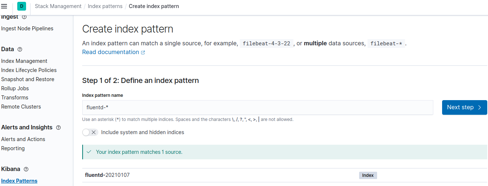
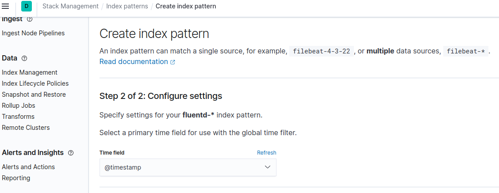
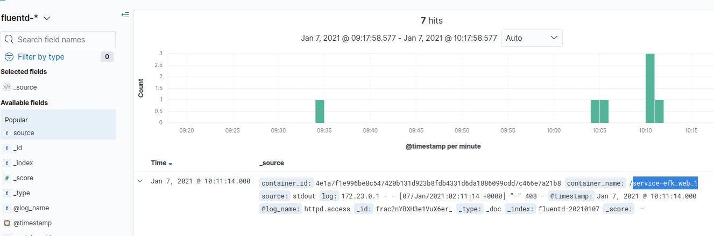

# EFK 日志收集

参考：

- https://github.com/ChenWes/docker-efk

- https://github.com/ChenWes/docker-elk

- https://docs.fluentd.org/container-deployment/docker-compose

## 使用

1. 启动服务 `docker-compose up -d --build`

2. 访问 httpd 服务，获得Access Logs

3. Browse to http://localhost:5601/ and set up the index name pattern for Kibana. Specify fluentd-* to Index name or pattern and click Create.

    

    

    Then, go to Discover tab to check the logs. As you can see, logs are properly collected into the Elasticsearch + Kibana, via Fluentd.

    