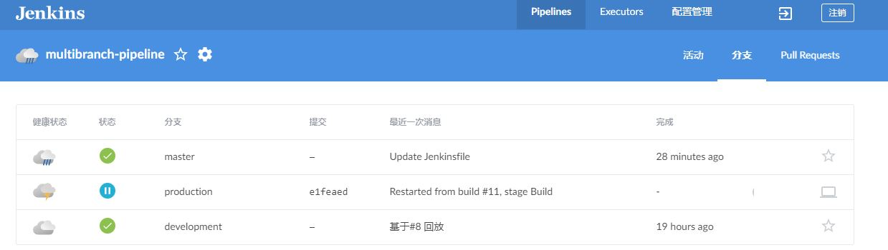
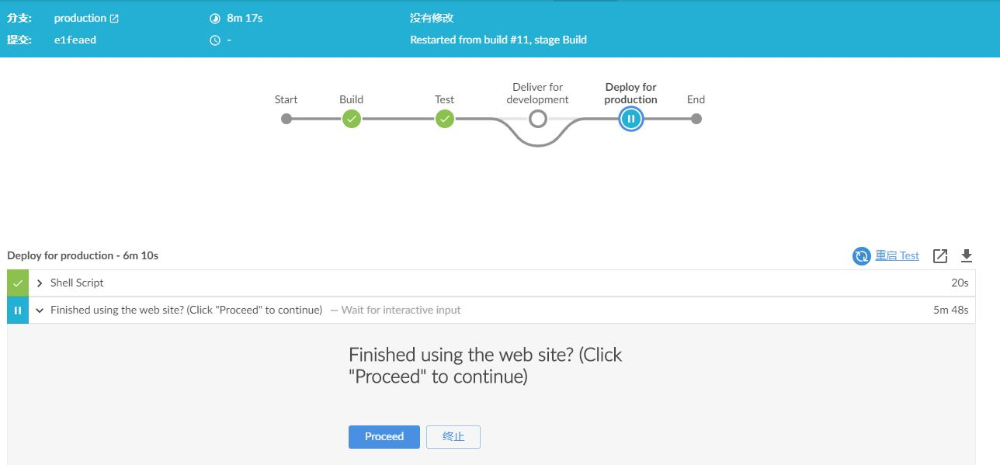
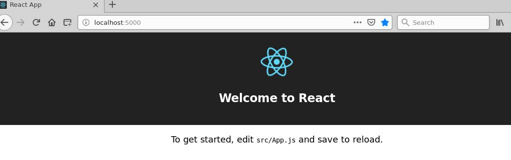

# building-a-multibranch-pipeline-project

本示例基于Node.js和React生成一个网页，该网页含有 "Welcome to React" 内容且伴随有一个检查应用程序满意度的测试

    - 使用docker 'Node' image 作为slave
   
    - 使用场景： 多分支CI/CD

This repository is for the
[Build a multibranch Pipeline project](https://jenkins.io/doc/tutorials/build-a-multibranch-pipeline-project/)
tutorial in the [Jenkins User Documentation](https://jenkins.io/doc/).

This tutorial uses the same application that the [Build a Node.js and React app
with
npm](https://jenkins.io/doc/tutorials/build-a-node-js-and-react-app-with-npm/)
tutorial is based on. Therefore, you'll be building and testing the same
application but this time, its delivery will be different depending on the Git
branch that Jenkins builds from. That is, the branch being built determines
which delivery stage of your Pipeline is executed.

The `jenkins` directory contains an example of the `Jenkinsfile` (i.e. Pipeline)
you'll be creating yourself during the tutorial and the `scripts` subdirectory
contains shell scripts with commands that are executed when Jenkins processes
either the "Deliver for development" or "Deploy for production" stages of your
Pipeline (depending on the branch that Jenkins builds from).

