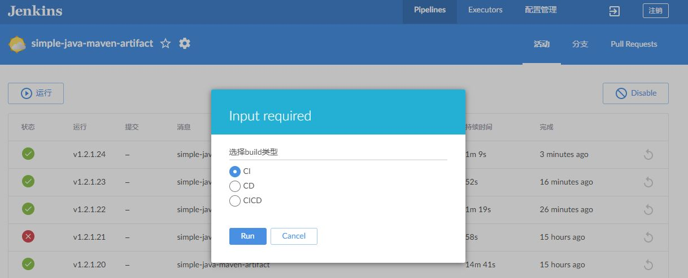
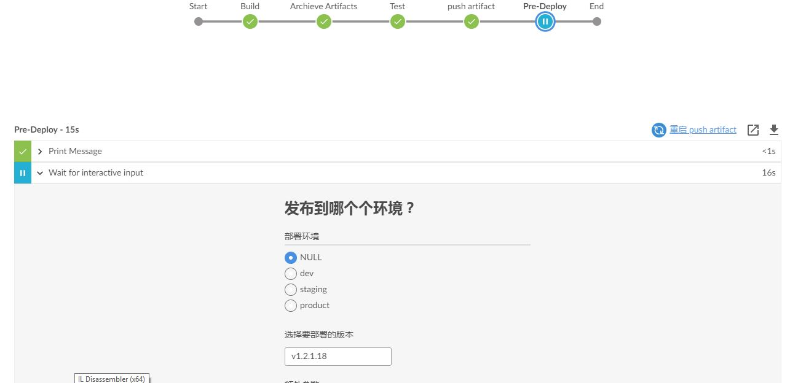
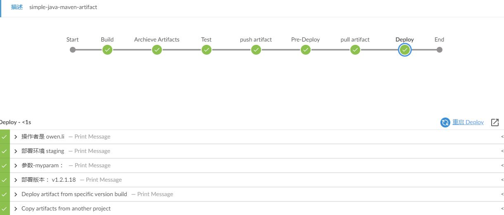
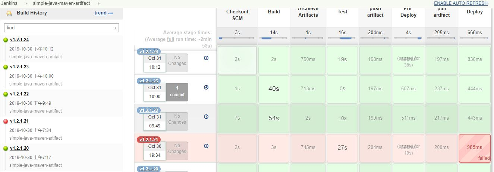

# simple-java-maven-artifact

这个demo主要是验证一些常见使用

- bat/ssh 不同平台使用
- pipeline build version 更新
- 单引号/双引号 区别
- 变量使用/打印
- **artifact 使用**
    - archive artifacts
    - copy artifacts from another job
- 参数化pipeline
- CI,CD,CICD 拆分，可以cover不同的场景

