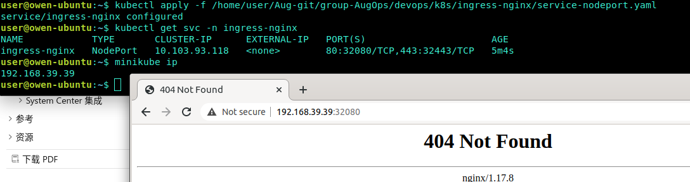

# Ingress-Nginx

[TOC]

Ingress的实现方式有很多 - <https://kubernetes.io/docs/concepts/services-networking/ingress-controllers/>

本次使用基于nginx的ingress -<https://github.com/kubernetes/ingress-nginx/tree/nginx-0.30.0>

## 1. 部署文件介绍

1. namespace.yaml
创建一个独立的命名空间 ingress-nginx

2. configmap.yaml
    ConfigMap是存储通用的配置变量的，`类似于配置文件`，使用户可以将分布式系统中用于不同模块的环境变量统一到一个对象中管理；而它与配置文件的区别在于它是存在集群的“环境”中的，并且支持K8S集群中所有通用的操作调用方式。

    从数据角度来看，ConfigMap的类型只是键值组，用于存储被Pod或者其他资源对象（如RC）访问的信息。这与secret的设计理念有异曲同工之妙，主要区别在于ConfigMap通常不用于存储敏感信息，而只存储简单的文本信息。

    ConfigMap可以保存环境变量的属性，也可以保存配置文件。
    创建pod时，对configmap进行绑定，pod内的应用可以直接引用ConfigMap的配置。相当于configmap为应用/运行环境封装配置。
    pod使用ConfigMap，通常用于：设置环境变量的值、设置命令行参数、创建配置文件

3. mandatory.yaml 包含部署deploy相关所有资源(configmap.yaml,namespace.yaml,rbac.yaml,with-rbac.yaml)

4. rbac.yaml
    负责Ingress的RBAC授权的控制，其创建了Ingress用到的ServiceAccount、ClusterRole、Role、RoleBinding、ClusterRoleBinding

5. with-rbac.yaml
    能使用rbac授权的deploy配置，用于构建ingress-controller。前面提到过，ingress-controller的作用是将新加入的Ingress进行转化为Nginx的配置

## 2. 部署配置Ingress Controller

### mandatory.yaml

`wget https://raw.githubusercontent.com/kubernetes/ingress-nginx/nginx-0.30.0/deploy/static/mandatory.yaml`

修改镜像路径image

`image: quay.io/kubernetes-ingress-controller/nginx-ingress-controller:0.30.1`

改成使用阿里的google库

`image: registry.aliyuncs.com/google_containers/nginx-ingress-controller:0.30.1`

### service-nodeport.yaml -部署service用于对外提供服务

`https://raw.githubusercontent.com/kubernetes/ingress-nginx/nginx-0.30.0/deploy/static/provider/baremetal/service-nodeport.yaml`

修改service-nodeport.yaml文件，添加NodePort端口，默认为随机端口

默认情况下k8s对外暴露端口范围只能是30000-32767，这个范围其实是可以通过设置改变的。

`sudo vim /etc/kubernetes/manifests/kube-apiserver.yaml`

在spec.containers.command 中添加如下配置，要注意格式

`- --service-node-port-range=1-65535`

apiserver会自动更新配置，稍等一会儿配置就会生效

``` text
kubectl apply -f mandatory.yaml
kubectl apply -f service-nodeport.yaml
```

### 查看ingress-nginx组件状态

 `kubectl get pods -n ingress-nginx    #pod状态`

 `kubectl get svc -n ingress-nginx  #service状态及暴露端口`

### 访问ingress-nginx服务，查看是否配置成功



可以看到，提示404，这个因为当前ingress-nginx服务现在还没有后端服务，这是正常的

## 3. 创建ingress-nginx后端服务

``` shell
kubectl apply -f myapp-deployment.yaml
kubectl apply -f myapp-ingress.yaml  # 定义ingress策略

kubectl apply -f tomcat-deployment.yaml
kubectl apply -f tomcat-ingress.yaml # 定义ingress策略
```

ingress设置了域名`myapp.magedu.com` 和 `tomcat.magedu.com`，客户端只能通过域名访问服务，这时要求客户端或者DNS将域名解析到后端的真是ip地址上

## 4. 对tomcat服务添加httpds服务

``` text
# 创建私有证书及secret

openssl genrsa -out tls.key 2048

#注意域名要和服务的域名一致
openssl req -new -x509 -key tls.key -out tls.crt -subj /C=CN/ST=Beijing/L=Beijing/O=DevOps/CN=tomcat.magedu.com

#创建secret
kubectl create secret tls tomcat-ingress-secret --cert=tls.crt --key=tls.key

kubectl get secret

kubectl describe secret tomcat-ingress-secret

kubectl apply -f tomcat-ingress-tls.yaml
```


## 5. 服务运行状态

- 访问服务


- Dashabord -Ingresses

