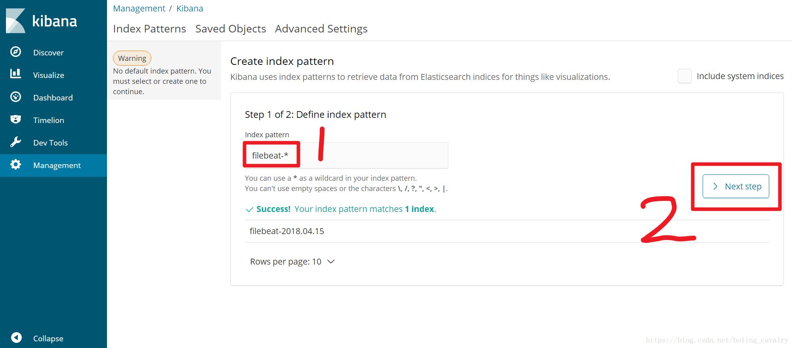
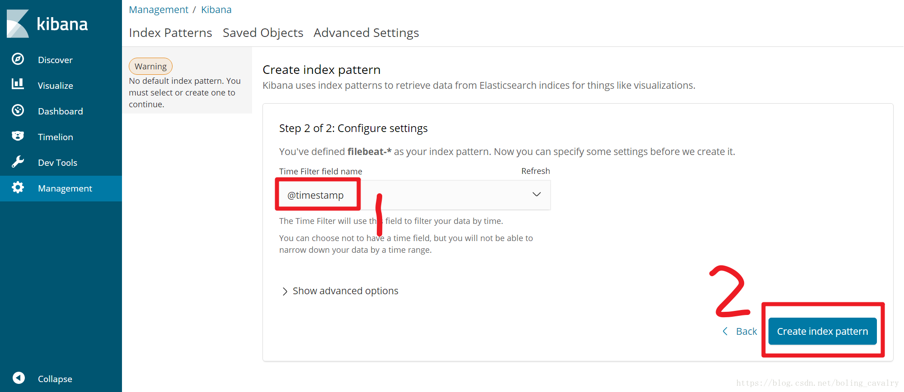
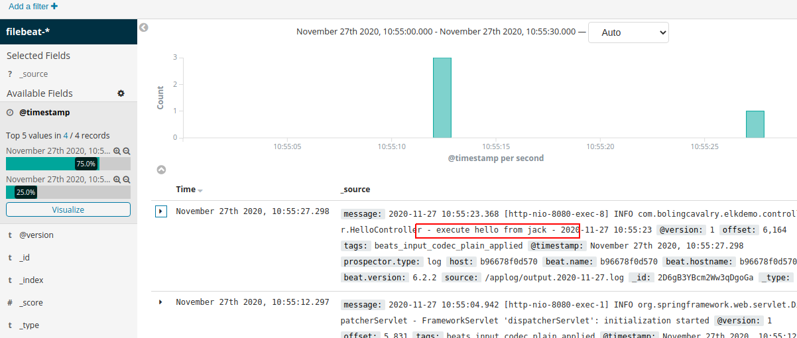
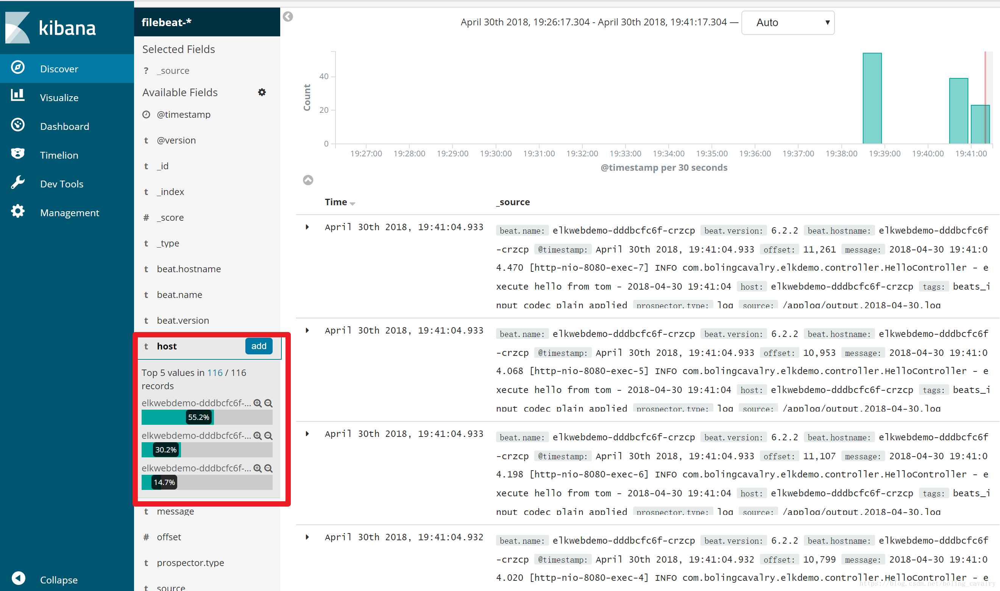

# K8S+ELK demo

## 环境准备

1. 打开文件/etc/sysctl.conf，添加下面一行内容：
   `vm.max_map_count=655360`

2. 加载sysctl配置，执行命令：`sysctl -p`

## 1. docker-compose 极速体验 ELK

### 部署服务

1. hub.docker.com镜像仓库中的`sebp/elk`，已集成了Elasticsearch, Logstash, Kibana，创建的容器直接作为ELK的server使用；
2. 制作一个镜像，起名为`bolingcavalry/springboot-app-filebeat`，这里面装好了filebeat，将web应用产生的日志上报到ELK server上去

    Dockerfile： https://github.com/zq2599/blog_demos/tree/master/filebeat_springboot_image_files
3. 基于springboot的web工程，在构建的时候使用docker-maven-plugin插件，将web工程制作成一个docker镜像，注意：基础镜像使用步骤2中的bolingcavalry/springboot-app-filebeat；

    参考： https://github.com/zq2599/blog_demos/blob/master/elkdemo

    ``` xml
    <!--镜像的FROM，使用bolingcavalry/springboot-app-filebeat:0.0.3-->
    <baseImage>bolingcavalry/springboot-app-filebeat:0.0.3</baseImage>
    <!--该镜像的容器启动后，直接运行spring boot工程-->
    <entryPoint>["sh","/filebeat-springboot-entrypoint.sh","/${project.build.finalName}.jar"]</entryPoint>
    ```

4. 制作docker-compose.yml，将步骤1和步骤3中的镜像配置进来，再配置好link；
5. 至此，所有材料就准备完成了，用`docker-compose up -d`命令即可快速体验；

### 验证业务日志

访问 Kibana - http://localhost:5602/

点击左上角的Discover按钮，如下图所示，提示创建“index pattern”：



下拉框中选择@timestamp，再点击Create index pattern



访问web服务 - http://localhost:18080/hello/jack 多按几次“F5”按钮刷新这个页面

去Kibana页面已经可以查到刚刚产生的业务日志了



## 2. 在 K8S 环境部署ELK

一共有两个Pod：ELK和web应用；

- ELK的Pod会暴露两个服务，一个暴露logstash的5044端口，给filebeat用，另一个暴露kibana的5601端口，给搜索日志的用户访问的时候用；

- web应用暴露一个服务，给用户通过浏览器访问；

### 验证业务日志

访问web服务 - http://localhost:30022/hello/test 多按几次“F5”按钮刷新这个页面



### web应用扩容

- 模拟生产环境的在线扩容 将web应用从一个扩展到三个，执行以下命令：

    `kubectl scale deployment elkwebdemo --replicas=3`

