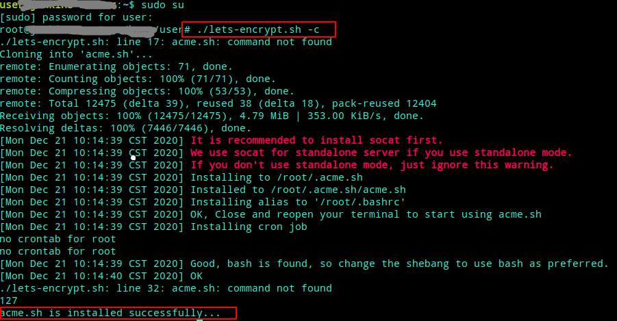

# lets-encrypt.sh

## 功能说明

基于acme.sh针对特定泛域名，生成对应证书，目前DNS提供商 支持Aliyun, DNSPod

1. 需要提前准备好对应DNS API 的key/ID, 用于验证你是否拥有该域名； 确保对应
2. 建议使用root执行
3. 证书生成过程会通过DNS API 添加 TXT类型记录

    

- 参数说明

    ``` shell
        ## Usage: $PROJECT_ENTRY <command> ... [parameters ...]
            Commands:
            -h, --help               Show this help message.
            -a, --all                All-In-One install which contains 'check','generate','install' action.
            -c, --check              Check if acme.sh is installed in current machine. If not, install it directly
            -i, --install            Install issued certs to the specific path
            -g, --generate           Generate issued certs based on Domain_Name (e.g. *.domain.com)
    ```

- 环境检查 acme.sh是否安装

    `source lets-encrypt.sh -c`

    

- 生成证书 （包含 环境检查，生成证书，安装证书到指定位置）

    `source lets-encrypt.sh -a`

